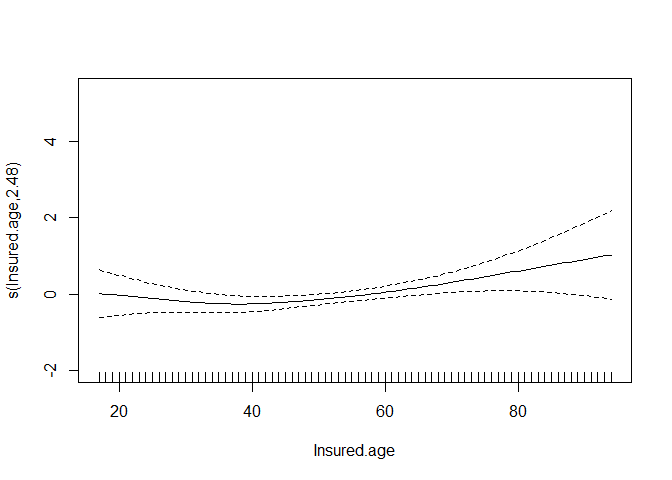
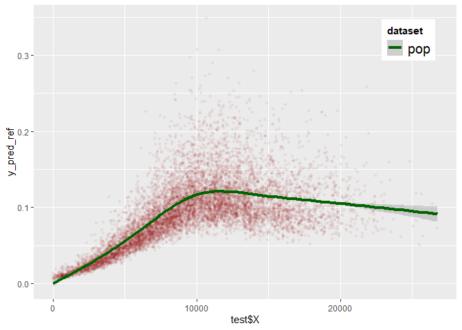
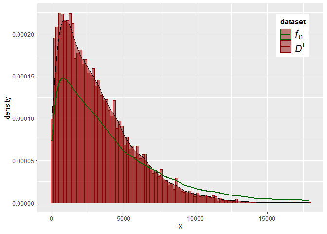
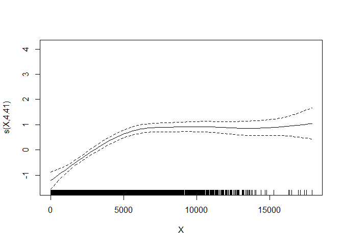
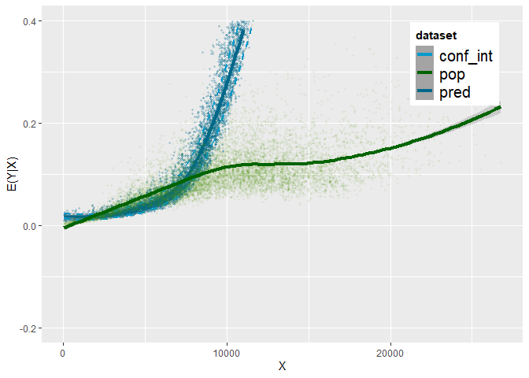
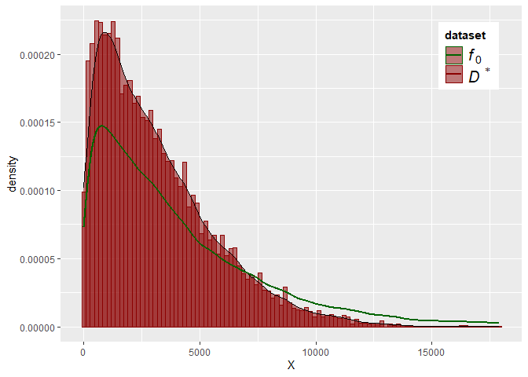
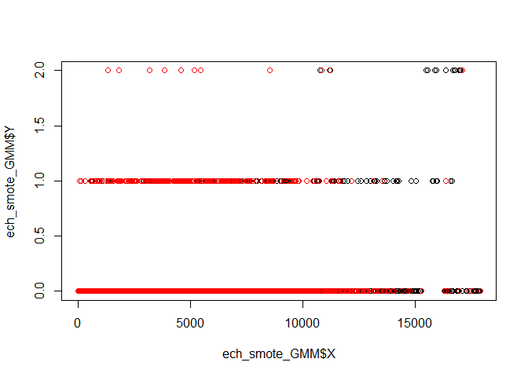

Data Augmentation for Imbalanced Regression - Application
================
Samuel STOCKSIEKER
25/01/2023

<style>
body {
text-align: justify}
</style>

*Import library*

*Workspace*

*Versioning*

``` r
sessionInfo()
```

    ## R version 4.2.2 (2022-10-31 ucrt)
    ## Platform: x86_64-w64-mingw32/x64 (64-bit)
    ## Running under: Windows 10 x64 (build 22621)
    ## 
    ## Matrix products: default
    ## 
    ## locale:
    ## [1] LC_COLLATE=French_France.utf8  LC_CTYPE=French_France.utf8   
    ## [3] LC_MONETARY=French_France.utf8 LC_NUMERIC=C                  
    ## [5] LC_TIME=French_France.utf8    
    ## 
    ## attached base packages:
    ## [1] splines   stats     graphics  grDevices utils     datasets  methods  
    ## [8] base     
    ## 
    ## other attached packages:
    ##  [1] knitr_1.41           latex2exp_0.9.6      seewave_2.2.0       
    ##  [4] statip_0.2.3         pscl_1.5.5           plotly_4.10.1       
    ##  [7] beepr_1.3            mda_0.5-3            class_7.3-20        
    ## [10] earth_5.3.1          plotmo_3.6.2         TeachingDemos_2.12  
    ## [13] plotrix_3.8-2        Formula_1.2-4        synthpop_1.8-0      
    ## [16] smotefamily_1.3.1    kernelboot_0.1.9     reticulate_1.27     
    ## [19] h2o_3.38.0.1         UBL_0.0.7            randomForest_4.7-1.1
    ## [22] automap_1.0-16       sp_1.5-1             gstat_2.1-0         
    ## [25] MBA_0.1-0            ggplot2_3.4.0        mclust_6.0.0        
    ## [28] Metrics_0.1.4        MASS_7.3-58.1        mgcv_1.8-41         
    ## [31] nlme_3.1-160        
    ## 
    ## loaded via a namespace (and not attached):
    ##  [1] TH.data_1.1-1       colorspace_2.0-3    modeltools_0.2-23  
    ##  [4] mipfp_3.2.1         rmutil_1.1.10       clue_0.3-63        
    ##  [7] rstudioapi_0.14     proxy_0.4-27        listenv_0.9.0      
    ## [10] audio_0.1-10        fansi_1.0.3         mvtnorm_1.1-3      
    ## [13] coin_1.4-2          ranger_0.14.1       codetools_0.2-18   
    ## [16] libcoin_1.0-9       jsonlite_1.8.4      cluster_2.1.4      
    ## [19] png_0.1-8           httr_1.4.4          compiler_4.2.2     
    ## [22] lazyeval_0.2.2      Matrix_1.5-1        fastmap_1.1.0      
    ## [25] strucchange_1.5-3   cli_3.5.0           htmltools_0.5.4    
    ## [28] tools_4.2.2         gtable_0.3.1        glue_1.6.2         
    ## [31] broman_0.80         dplyr_1.0.10        Rcpp_1.0.9         
    ## [34] vctrs_0.5.1         xfun_0.36           stringr_1.5.0      
    ## [37] globals_0.16.2      proto_1.0.0         lifecycle_1.0.3    
    ## [40] cmm_0.12            future_1.30.0       polspline_1.1.22   
    ## [43] zoo_1.8-11          scales_1.2.1        parallel_4.2.2     
    ## [46] sandwich_3.0-2      yaml_2.3.6          rpart_4.1.19       
    ## [49] reshape_0.8.9       stringi_1.7.8       maptools_1.1-6     
    ## [52] e1071_1.7-12        truncnorm_1.0-8     tuneR_1.4.2        
    ## [55] intervals_0.15.2    rlang_1.0.6         pkgconfig_2.0.3    
    ## [58] matrixStats_0.63.0  bitops_1.0-7        Rsolnp_1.16        
    ## [61] evaluate_0.19       lattice_0.20-45     purrr_1.0.0        
    ## [64] htmlwidgets_1.6.1   tidyselect_1.2.0    parallelly_1.34.0  
    ## [67] plyr_1.8.8          magrittr_2.0.3      R6_2.5.1           
    ## [70] generics_0.1.3      multcomp_1.4-20     pillar_1.8.1       
    ## [73] foreign_0.8-83      withr_2.5.0         xts_0.12.2         
    ## [76] survival_3.4-0      RCurl_1.98-1.10     nnet_7.3-18        
    ## [79] tibble_3.1.8        future.apply_1.10.0 spacetime_1.2-8    
    ## [82] KernSmooth_2.23-20  utf8_1.2.2          party_1.3-11       
    ## [85] rmarkdown_2.19      grid_4.2.2          data.table_1.14.6  
    ## [88] FNN_1.1.3.1         digest_0.6.31       classInt_0.4-8     
    ## [91] tidyr_1.2.1         numDeriv_2016.8-1.1 signal_0.7-7       
    ## [94] stats4_4.2.2        munsell_0.5.0       viridisLite_0.4.1

Show in New Window R version 4.2.0 (2022-04-22 ucrt) Platform:
x86_64-w64-mingw32/x64 (64-bit) Running under: Windows 10 x64 (build
19045)

Matrix products: default

locale: \[1\] LC_COLLATE=French_France.utf8 LC_CTYPE=French_France.utf8
LC_MONETARY=French_France.utf8 \[4\] LC_NUMERIC=C
LC_TIME=French_France.utf8

attached base packages: \[1\] splines stats graphics grDevices utils
datasets methods base

other attached packages: \[1\] knitr_1.39 seewave_2.2.0 statip_0.2.3
pscl_1.5.5 plotly_4.10.0  
\[6\] beepr_1.3 mda_0.5-3 class_7.3-20 earth_5.3.1 plotmo_3.6.1  
\[11\] TeachingDemos_2.12 plotrix_3.8-2 Formula_1.2-4 synthpop_1.7-0
smotefamily_1.3.1 \[16\] kernelboot_0.1.7 reticulate_1.25 UBL_0.0.7
randomForest_4.7-1 automap_1.0-16  
\[21\] sp_1.4-7 gstat_2.0-9 MBA_0.0-9 ggplot2_3.4.0 mclust_5.4.9  
\[26\] Metrics_0.1.4 MASS_7.3-57 mgcv_1.8-40 nlme_3.1-157

loaded via a namespace (and not attached): \[1\] TH.data_1.1-1
colorspace_2.0-3 ellipsis_0.3.2 modeltools_0.2-23 mipfp_3.2.1  
\[6\] rprojroot_2.0.3 clue_0.3-61 rstudioapi_0.14 proxy_0.4-26
listenv_0.8.0  
\[11\] audio_0.1-10 fansi_1.0.3 mvtnorm_1.1-3 coin_1.4-2 ranger_0.13.1  
\[16\] codetools_0.2-18 libcoin_1.0-9 jsonlite_1.8.0 cluster_2.1.3
png_0.1-7  
\[21\] compiler_4.2.0 httr_1.4.3 Matrix_1.5-3 fastmap_1.1.0
lazyeval_0.2.2  
\[26\] strucchange_1.5-2 cli_3.3.0 htmltools_0.5.2 tools_4.2.0
gtable_0.3.0  
\[31\] glue_1.6.2 dplyr_1.0.9 rappdirs_0.3.3 Rcpp_1.0.8.3 vctrs_0.5.1  
\[36\] xfun_0.31 stringr_1.4.0 globals_0.15.0 proto_1.0.0
lifecycle_1.0.3  
\[41\] cmm_0.12 future_1.25.0 polspline_1.1.20 zoo_1.8-10 scales_1.2.0  
\[46\] parallel_4.2.0 sandwich_3.0-1 yaml_2.3.5 rpart_4.1.16
reshape_0.8.9  
\[51\] stringi_1.7.6 maptools_1.1-4 e1071_1.7-9 truncnorm_1.0-8
tuneR_1.4.0  
\[56\] intervals_0.15.2 rlang_1.0.6 pkgconfig_2.0.3 matrixStats_0.62.0
Rsolnp_1.16  
\[61\] evaluate_0.15 lattice_0.20-45 purrr_0.3.4 htmlwidgets_1.5.4
tidyselect_1.1.2  
\[66\] here_1.0.1 parallelly_1.31.1 plyr_1.8.7 magrittr_2.0.3 R6_2.5.1  
\[71\] generics_0.1.2 multcomp_1.4-19 pillar_1.7.0 foreign_0.8-82
withr_2.5.0  
\[76\] xts_0.12.1 survival_3.3-1 nnet_7.3-17 tibble_3.1.7
future.apply_1.9.0 \[81\] spacetime_1.2-6 crayon_1.5.1
KernSmooth_2.23-20 utf8_1.2.2 party_1.3-10  
\[86\] rmarkdown_2.14 grid_4.2.0 data.table_1.14.2 FNN_1.1.3
digest_0.6.29  
\[91\] classInt_0.4-3 numDeriv_2016.8-1.1 tidyr_1.2.0 signal_0.7-7
stats4_4.2.0  
\[96\] munsell_0.5.0 viridisLite_0.4.0

*Sources*

dataset : <http://www2.math.uconn.edu/~valdez/data.html> paper :
Synthetic Dataset Generation of Driver Telematics :
<https://arxiv.org/pdf/2102.00252.pdf>

*initialization*

``` r
gam_rmse = data.frame("ech" = rep(" ",22), "rmse" = rep(0,22))
gam_rmse$ech = c("base",
"ech_rep",
"train",
"ech_add",
"ech_GN_SC",
"GN_GMM",
"ech_ROSE_SC",
"ROSE_GMM",
"kde_boot",
"kde_boot_GMM",
"kde_boot_cond",
"GMM_cond",
"FA_GMM",
"FA_cond",
"ech_copule_cond",
"ech_ctganSynth_Y",
"ech_RF",
"ech_RF_cond",
"ech_RF_GMM",
"ech_smote",
"ech_smote_GMM",
"ech_smote_cond"
) 

gam_rmse_ref = data.frame("ech" = rep(" ",21), "rmse" = rep(0,21))
gam_rmse_ref$ech = c("ech_rep",
"train",
"ech_add",
"ech_GN_SC",
"GN_GMM",
"ech_ROSE_SC",
"ROSE_GMM",
"kde_boot",
"kde_boot_GMM",
"kde_boot_cond",
"GMM_cond",
"FA_GMM",
"FA_cond",
"ech_copule_cond",
"ech_ctganSynth_Y",
"ech_RF",
"ech_RF_cond",
"ech_RF_GMM",
"ech_smote",
"ech_smote_GMM",
"ech_smote_cond"
) 
```

# Dataset

## Analysis

``` r
sapply(base0,class)
```

    ##               Duration            Insured.age            Insured.sex 
    ##              "integer"              "integer"            "character" 
    ##                Car.age                Marital                Car.use 
    ##              "integer"            "character"            "character" 
    ##           Credit.score                 Region     Annual.miles.drive 
    ##              "numeric"            "character"              "numeric" 
    ##         Years.noclaims              Territory      Annual.pct.driven 
    ##              "integer"              "integer"              "numeric" 
    ##     Total.miles.driven          Pct.drive.mon          Pct.drive.tue 
    ##              "numeric"              "numeric"              "numeric" 
    ##          Pct.drive.wed          Pct.drive.thr          Pct.drive.fri 
    ##              "numeric"              "numeric"              "numeric" 
    ##          Pct.drive.sat          Pct.drive.sun         Pct.drive.2hrs 
    ##              "numeric"              "numeric"              "numeric" 
    ##         Pct.drive.3hrs         Pct.drive.4hrs        Pct.drive.wkday 
    ##              "numeric"              "numeric"              "numeric" 
    ##        Pct.drive.wkend      Pct.drive.rush.am      Pct.drive.rush.pm 
    ##              "numeric"              "numeric"              "numeric" 
    ##           Avgdays.week          Accel.06miles          Accel.08miles 
    ##              "numeric"              "numeric"              "numeric" 
    ##          Accel.09miles          Accel.11miles          Accel.12miles 
    ##              "numeric"              "numeric"              "numeric" 
    ##          Accel.14miles          Brake.06miles          Brake.08miles 
    ##              "numeric"              "numeric"              "numeric" 
    ##          Brake.09miles          Brake.11miles          Brake.12miles 
    ##              "numeric"              "numeric"              "numeric" 
    ##          Brake.14miles  Left.turn.intensity08  Left.turn.intensity09 
    ##              "numeric"              "numeric"              "numeric" 
    ##  Left.turn.intensity10  Left.turn.intensity11  Left.turn.intensity12 
    ##              "numeric"              "numeric"              "numeric" 
    ## Right.turn.intensity08 Right.turn.intensity09 Right.turn.intensity10 
    ##              "numeric"              "numeric"              "numeric" 
    ## Right.turn.intensity11 Right.turn.intensity12               NB_Claim 
    ##              "numeric"              "numeric"              "integer" 
    ##              AMT_Claim 
    ##              "numeric"

``` r
base0$Duration=base0$Duration/366
base0$tmd100 = round(base0$Total.miles.driven/100,0)*100
summary(base0)
```

    ##     Duration        Insured.age     Insured.sex           Car.age     
    ##  Min.   :0.07377   Min.   : 16.00   Length:100000      Min.   :-2.00  
    ##  1st Qu.:0.54645   1st Qu.: 39.00   Class :character   1st Qu.: 2.00  
    ##  Median :0.99727   Median : 51.00   Mode  :character   Median : 5.00  
    ##  Mean   :0.85848   Mean   : 51.38                      Mean   : 5.64  
    ##  3rd Qu.:1.00000   3rd Qu.: 63.00                      3rd Qu.: 8.00  
    ##  Max.   :1.00000   Max.   :103.00                      Max.   :20.00  
    ##    Marital            Car.use           Credit.score      Region         
    ##  Length:100000      Length:100000      Min.   :422.0   Length:100000     
    ##  Class :character   Class :character   1st Qu.:766.0   Class :character  
    ##  Mode  :character   Mode  :character   Median :825.0   Mode  :character  
    ##                                        Mean   :800.9                     
    ##                                        3rd Qu.:856.0                     
    ##                                        Max.   :900.0                     
    ##  Annual.miles.drive Years.noclaims    Territory     Annual.pct.driven
    ##  Min.   :    0      Min.   : 0.00   Min.   :11.00   Min.   :0.00274  
    ##  1st Qu.: 6214      1st Qu.:15.00   1st Qu.:35.00   1st Qu.:0.24932  
    ##  Median : 7456      Median :29.00   Median :62.00   Median :0.49041  
    ##  Mean   : 9124      Mean   :28.84   Mean   :56.53   Mean   :0.50229  
    ##  3rd Qu.:12427      3rd Qu.:41.00   3rd Qu.:78.00   3rd Qu.:0.75342  
    ##  Max.   :56731      Max.   :79.00   Max.   :91.00   Max.   :1.00000  
    ##  Total.miles.driven Pct.drive.mon    Pct.drive.tue    Pct.drive.wed   
    ##  Min.   :    0.1    Min.   :0.0000   Min.   :0.0000   Min.   :0.0000  
    ##  1st Qu.: 1529.9    1st Qu.:0.1209   1st Qu.:0.1301   1st Qu.:0.1293  
    ##  Median : 3468.3    Median :0.1379   Median :0.1479   Median :0.1471  
    ##  Mean   : 4833.6    Mean   :0.1394   Mean   :0.1513   Mean   :0.1483  
    ##  3rd Qu.: 6779.9    3rd Qu.:0.1552   3rd Qu.:0.1685   3rd Qu.:0.1659  
    ##  Max.   :47282.6    Max.   :0.9982   Max.   :1.0000   Max.   :1.0000  
    ##  Pct.drive.thr    Pct.drive.fri    Pct.drive.sat    Pct.drive.sun    
    ##  Min.   :0.0000   Min.   :0.0000   Min.   :0.0000   Min.   :0.00000  
    ##  1st Qu.:0.1336   1st Qu.:0.1386   1st Qu.:0.1094   1st Qu.:0.08526  
    ##  Median :0.1514   Median :0.1560   Median :0.1347   Median :0.11071  
    ##  Mean   :0.1530   Mean   :0.1576   Mean   :0.1379   Mean   :0.11252  
    ##  3rd Qu.:0.1706   3rd Qu.:0.1745   3rd Qu.:0.1613   3rd Qu.:0.13476  
    ##  Max.   :0.9979   Max.   :0.9986   Max.   :0.9466   Max.   :0.97606  
    ##  Pct.drive.2hrs     Pct.drive.3hrs      Pct.drive.4hrs      Pct.drive.wkday 
    ##  Min.   :0.000000   Min.   :0.0000000   Min.   :0.0000000   Min.   :0.0000  
    ##  1st Qu.:0.000000   1st Qu.:0.0000000   1st Qu.:0.0000000   1st Qu.:0.7103  
    ##  Median :0.001308   Median :0.0000000   Median :0.0000000   Median :0.7525  
    ##  Mean   :0.003931   Mean   :0.0008682   Mean   :0.0002418   Mean   :0.7495  
    ##  3rd Qu.:0.004791   3rd Qu.:0.0005843   3rd Qu.:0.0000000   3rd Qu.:0.7953  
    ##  Max.   :0.455742   Max.   :0.3238315   Max.   :0.2658870   Max.   :1.0000  
    ##  Pct.drive.wkend  Pct.drive.rush.am Pct.drive.rush.pm  Avgdays.week   
    ##  Min.   :0.0000   Min.   :0.00000   Min.   :0.00000   Min.   :0.2009  
    ##  1st Qu.:0.2047   1st Qu.:0.03739   1st Qu.:0.09042   1st Qu.:4.9116  
    ##  Median :0.2475   Median :0.07801   Median :0.12984   Median :5.8902  
    ##  Mean   :0.2505   Mean   :0.09782   Mean   :0.13760   Mean   :5.5331  
    ##  3rd Qu.:0.2897   3rd Qu.:0.14084   3rd Qu.:0.17435   3rd Qu.:6.4875  
    ##  Max.   :1.0000   Max.   :0.98804   Max.   :0.99318   Max.   :7.0000  
    ##  Accel.06miles   Accel.08miles     Accel.09miles     Accel.11miles     
    ##  Min.   :  0.0   Min.   :  0.000   Min.   :  0.000   Min.   :  0.0000  
    ##  1st Qu.:  9.0   1st Qu.:  0.000   1st Qu.:  0.000   1st Qu.:  0.0000  
    ##  Median : 24.0   Median :  1.000   Median :  0.000   Median :  0.0000  
    ##  Mean   : 43.1   Mean   :  4.532   Mean   :  1.754   Mean   :  0.9292  
    ##  3rd Qu.: 52.0   3rd Qu.:  3.000   3rd Qu.:  1.000   3rd Qu.:  0.0000  
    ##  Max.   :621.0   Max.   :621.000   Max.   :621.000   Max.   :621.0000  
    ##  Accel.12miles      Accel.14miles     Brake.06miles    Brake.08miles    
    ##  Min.   :  0.0000   Min.   :  0.000   Min.   :  0.00   Min.   :  0.000  
    ##  1st Qu.:  0.0000   1st Qu.:  0.000   1st Qu.: 33.00   1st Qu.:  3.000  
    ##  Median :  0.0000   Median :  0.000   Median : 60.00   Median :  6.000  
    ##  Mean   :  0.5251   Mean   :  0.357   Mean   : 83.65   Mean   :  9.594  
    ##  3rd Qu.:  0.0000   3rd Qu.:  0.000   3rd Qu.:107.00   3rd Qu.: 11.000  
    ##  Max.   :621.0000   Max.   :621.000   Max.   :621.00   Max.   :621.000  
    ##  Brake.09miles     Brake.11miles     Brake.12miles      Brake.14miles    
    ##  Min.   :  0.000   Min.   :  0.000   Min.   :  0.0000   Min.   :  0.000  
    ##  1st Qu.:  1.000   1st Qu.:  0.000   1st Qu.:  0.0000   1st Qu.:  0.000  
    ##  Median :  2.000   Median :  1.000   Median :  0.0000   Median :  0.000  
    ##  Mean   :  3.103   Mean   :  1.349   Mean   :  0.5899   Mean   :  0.355  
    ##  3rd Qu.:  3.000   3rd Qu.:  1.000   3rd Qu.:  0.0000   3rd Qu.:  0.000  
    ##  Max.   :621.000   Max.   :621.000   Max.   :621.0000   Max.   :621.000  
    ##  Left.turn.intensity08 Left.turn.intensity09 Left.turn.intensity10
    ##  Min.   :     0.0      Min.   :     0.0      Min.   :     0.0     
    ##  1st Qu.:     7.0      1st Qu.:     2.0      1st Qu.:     0.0     
    ##  Median :    66.0      Median :    22.0      Median :     3.0     
    ##  Mean   :   915.7      Mean   :   718.1      Mean   :   551.6     
    ##  3rd Qu.:   361.0      3rd Qu.:   146.0      3rd Qu.:    30.0     
    ##  Max.   :794740.0      Max.   :794676.0      Max.   :794380.0     
    ##  Left.turn.intensity11 Left.turn.intensity12 Right.turn.intensity08
    ##  Min.   :     0.0      Min.   :     0.0      Min.   :     0.0      
    ##  1st Qu.:     0.0      1st Qu.:     0.0      1st Qu.:    11.0      
    ##  Median :     1.0      Median :     0.0      Median :   122.0      
    ##  Mean   :   487.3      Mean   :   447.8      Mean   :   843.5      
    ##  3rd Qu.:     9.0      3rd Qu.:     2.0      3rd Qu.:   680.0      
    ##  Max.   :793926.0      Max.   :793170.0      Max.   :841210.0      
    ##  Right.turn.intensity09 Right.turn.intensity10 Right.turn.intensity11
    ##  Min.   :     0.0       Min.   :     0.0       Min.   :     0.0      
    ##  1st Qu.:     3.0       1st Qu.:     0.0       1st Qu.:     0.0      
    ##  Median :    43.0       Median :     7.0       Median :     2.0      
    ##  Mean   :   565.1       Mean   :   326.7       Mean   :   246.7      
    ##  3rd Qu.:   321.0       3rd Qu.:    81.0       3rd Qu.:    27.0      
    ##  Max.   :841207.0       Max.   :841200.0       Max.   :841176.0      
    ##  Right.turn.intensity12    NB_Claim         AMT_Claim            tmd100     
    ##  Min.   :     0.0       Min.   :0.00000   Min.   :     0.0   Min.   :    0  
    ##  1st Qu.:     0.0       1st Qu.:0.00000   1st Qu.:     0.0   1st Qu.: 1500  
    ##  Median :     0.0       Median :0.00000   Median :     0.0   Median : 3500  
    ##  Mean   :   198.8       Mean   :0.04494   Mean   :   137.6   Mean   : 4834  
    ##  3rd Qu.:     9.0       3rd Qu.:0.00000   3rd Qu.:     0.0   3rd Qu.: 6800  
    ##  Max.   :841144.0       Max.   :3.00000   Max.   :104074.9   Max.   :47300

Histogramms of Total.miles.driven

``` r
hist(base0$Total.miles.driven, breaks = 100)
```

<!-- -->

## Modeling

``` r
n_ech = 10000 # size of the train sample
if (rerun == T){
  ind_test = sample(nrow(base0),n_ech)
  test = base0[ind_test,]
  base = base0[-ind_test,]
}
```

Graphical analysis

``` r
if (rerun == T){
  resModelRef = function(dat,y_pred_ref){
    agg = aggregate(NB_Claim~tmd100,dat,mean)
    plot(agg$tmd100,agg$NB_Claim, col="blue")
    agg = aggregate(yhat~tmd100,dat,mean)
    points(agg$tmd100,agg$yhat, col="orange")
  
    agg = aggregate(NB_Claim~Insured.age,dat,mean)
    plot(agg$Insured.age,agg$NB_Claim, col="blue")
    agg = aggregate(yhat~Insured.age,dat,mean)
    points(agg$Insured.age,agg$yhat, col="orange")
  
    agg = aggregate(NB_Claim~Credit.score,dat,mean)
    plot(agg$Credit.score,agg$NB_Claim, col="blue")
    agg = aggregate(yhat~Credit.score,dat,mean)
    points(agg$Credit.score,agg$yhat, col="orange")
  
    agg = aggregate(NB_Claim~Years.noclaims,dat,mean)
    plot(agg$Years.noclaims,agg$NB_Claim, col="blue")
    agg = aggregate(yhat~Years.noclaims,dat,mean)
    points(agg$Years.noclaims,agg$yhat, col="orange")
  
    ggplot() +
    geom_point(alpha=0.05,aes(x=test$Total.miles.driven, y=y_pred_ref),colour="darkred", shape=20, size=2)+
          stat_smooth(aes(x=test$Total.miles.driven, y=y_pred_ref,colour="pop"),method = loess, lwd=1.5)+
        scale_color_manual(name = "dataset",values = c("pop" = "darkgreen")) +   theme(legend.position = c(.95, .95),legend.justification = c("right", "top"),legend.title = element_text(face = "bold"),legend.text = element_text(size=15,hjust=0))
  }
}
```

### GAM - poisson (without categorical covariate) with MGCV

``` r
if (rerun == T){
  dat = base
  
  # Model
  reg = gam(NB_Claim ~  s(Insured.age) + Car.age + s(Total.miles.driven) + Credit.score + Years.noclaims, offset = log(Duration), data = dat, family = poisson())
  reg_P = reg
  
  # Results
  reg$aic
  AIC(reg)
  summary(reg)
  plot(reg)
  gam.check(reg)
  
  # predictions
  dat$yhat = reg$fitted.values
  y_pred_ref = predict(reg,test,type="response")
  y_pred_ref_P = y_pred_ref
  resModelRef(dat,y_pred_ref)
}
```

### GAM - ZIP (mixed covariate) avec MGCV

``` r
if (rerun == T){  
  dat = base
  
  # Model
  reg = gam(NB_Claim ~  s(Insured.age) + Car.age + Car.use + Region + s(Total.miles.driven) + Credit.score + Years.noclaims, offset = log(Duration), data = dat, family = ziP())
  reg_ZM = reg
  
  # Results
  reg$aic
  AIC(reg)
  summary(reg)
  plot(reg)
  gam.check(reg)
  
  # predictions
  dat$yhat = reg$fitted.values
  y_pred_ref = predict(reg,test,type="response")
  y_pred_ref_ZM = y_pred_ref
  resModelRef(dat,y_pred_ref)
}
```

### GAM - ZIP (without categorical covariate) with MGCV

``` r
if (rerun == T){
  dat = base

  # Model
  reg = gam(NB_Claim ~  s(Insured.age) + Car.age + s(Total.miles.driven) + Credit.score + Years.noclaims, offset = log(Duration), data = dat, family = ziP())
  reg_ZQ = reg

  # Results
  reg$aic
  AIC(reg)
  summary(reg)
  plot(reg)
  gam.check(reg)

  # predictions
  dat$yhat = reg$fitted.values
  y_pred_ref = predict(reg,test,type="response")
  y_pred_ref_ZQ = y_pred_ref
  resModelRef(dat,y_pred_ref)
}
```

### GAM - ZIP (without categorical covariate) with PSCL

``` r
if (rerun == T){
  dat = base
  
  # Model
  reg = zeroinfl(NB_Claim ~ bs(Insured.age, degree = 3) + Car.age + bs(Total.miles.driven,degree = 3) + Credit.score + Years.noclaims + offset(log(Duration)) | bs(Insured.age, degree = 3) + Car.age + bs(Total.miles.driven,degree = 3) + Credit.score + Years.noclaims + offset(log(Duration)) , data = dat, dist = "poisson", link = "logit")
  reg_ZI = reg
  
  # Results
  AIC(reg)
  summary(reg)
  
  # predictions
  dat$yhat = reg$fitted.values
  y_pred_ref = predict(reg,test,type="response")
  y_pred_ref_ZI = y_pred_ref
  resModelRef(dat,y_pred_ref)
}
```

### Optimization of GAM - ZIP according to AIC

Warning : the optimization is quite long..

``` r
if (rerun == T){
  dat = base

  # # modèle : optim AIC : degre splines
  # res = expand.grid(1:3,1:3,1:3,1:3)
  # res[,5] = rep(0,nrow(res))
  # for (i in (1:nrow(res))){
  #         reg = zeroinfl(NB_Claim ~ bs(Insured.age, degree = res[i,1]) + Car.age + bs(Total.miles.driven,degree = res[i,2]) + Credit.score + Years.noclaims + offset(log(Duration)) | bs(Insured.age, degree = res[i,3]) + Car.age + bs(Total.miles.driven,degree = res[i,4]) + offset(log(Duration)) , data = dat, dist = "poisson", link = "logit")
  #         res[i,5] = AIC(reg)
  # }
  # res[order(res$V5),]
  # beep(8)
  
  # model retenu : selection variables
  reg = zeroinfl(NB_Claim ~ bs(Insured.age, degree = 3) + Car.age + bs(Total.miles.driven,degree = 2) + Credit.score + Years.noclaims + offset(log(Duration)) | bs(Insured.age, degree = 2) + Car.age + bs(Total.miles.driven,degree = 3) + offset(log(Duration)) , data = dat, dist = "poisson", link = "logit")
    reg_ZIs = reg
  
  # Results
  AIC(reg)
  summary(reg)
  
  # predictions
  dat$yhat = reg$fitted.values
  y_pred_ref = predict(reg,test,type="response")
  y_pred_ref_ZIs = y_pred_ref
  resModelRef(dat,y_pred_ref)
}
```

### Random forest

``` r
if (rerun == T){
  dat = base
  
  # Predictions
  #reg = randomForest( NB_Claim ~ Insured.age + Car.age + Total.miles.driven + Credit.score + Years.noclaims + Duration , data = dat)# , weights = q)
  
  h2o.init()
  reg = h2o.randomForest(x=c("Insured.age" , "Car.age", "Total.miles.driven", "Credit.score", "Years.noclaims"),y="NB_Claim", offset_column ="Duration",training_frame= as.h2o(dat), ntrees = 500)
  
  reg_RF = reg
  
  # Results
  summary(reg) 
  
  # predictions
  dat$yhat = as.vector(h2o.predict(reg,as.h2o(dat)))
  y_pred_ref = as.vector(h2o.predict(reg,as.h2o(test)))
  y_pred_ref_RF = y_pred_ref
  resModelRef(dat,y_pred_ref)
}
```

Comparison

``` r
if (rerun == T){
  AIC(reg_P)
  AIC(reg_ZM)
  AIC(reg_ZQ)
  AIC(reg_ZI)
  AIC(reg_ZIs)
  
  rmse(test$NB_Claim,y_pred_ref_P)*100 
  rmse(test$NB_Claim,y_pred_ref_ZM)*100
  rmse(test$NB_Claim,y_pred_ref_ZQ)*100
  rmse(test$NB_Claim,y_pred_ref_ZI)*100
  rmse(test$NB_Claim,y_pred_ref_ZIs)*100 
  rmse(test$NB_Claim,y_pred_ref_RF)*100 
}
```

### Model Selection

## Features selection and redefinition

``` r
dat = base
reg_ref = modelApp(dat)

# Results
AIC(reg_ref)
```

    ## [1] 27088.31

``` r
summary(reg_ref)
```

    ## 
    ## Family: Zero inflated Poisson(0.045,1.073) 
    ## Link function: identity 
    ## 
    ## Formula:
    ## Y ~ s(Insured.age) + Car.age + s(X) + Credit.score + Years.noclaims
    ## 
    ## Parametric coefficients:
    ##                  Estimate Std. Error z value Pr(>|z|)    
    ## (Intercept)    -0.8144933  0.1435473  -5.674 1.39e-08 ***
    ## Car.age        -0.0421681  0.0042585  -9.902  < 2e-16 ***
    ## Credit.score   -0.0024942  0.0001722 -14.486  < 2e-16 ***
    ## Years.noclaims -0.0126578  0.0016369  -7.733 1.05e-14 ***
    ## ---
    ## Signif. codes:  0 '***' 0.001 '**' 0.01 '*' 0.05 '.' 0.1 ' ' 1
    ## 
    ## Approximate significance of smooth terms:
    ##                  edf Ref.df Chi.sq p-value    
    ## s(Insured.age) 6.117  7.004  143.4  <2e-16 ***
    ## s(X)           8.267  8.823 1634.2  <2e-16 ***
    ## ---
    ## Signif. codes:  0 '***' 0.001 '**' 0.01 '*' 0.05 '.' 0.1 ' ' 1
    ## 
    ## Deviance explained = 88.9%
    ## -REML =  13579  Scale est. = 1         n = 90000

``` r
# predictions
dat$yhat = reg_ref$fitted.values 
y_pred_ref = predict(reg_ref,test,type="response")
resModelRef(dat,y_pred_ref)
```

<!-- --><!-- --><!-- -->

    ## `geom_smooth()` using formula = 'y ~ x'

<!-- -->

``` r
# Indicators
k_rmse = which(gam_rmse$ech == "base")
gam_rmse$rmse[k_rmse] = rmse(test$Y,y_pred_ref)*100
```

## Sample drawing

``` r
if (rerun == T){
  ech_rep = base[sample(nrow(base),n_ech),]
}
hist(ech_rep$X, breaks=100)
```

<!-- -->

``` r
if (rerun == T){
  train = base[sample(nrow(base),n_ech,prob=dnorm(base$X,2000,6000)),]
}

df_train=data.frame(train$X,rep("imb",length(train$X)))
df_test=data.frame(base$X,rep("pop",length(base$X)))
colnames(df_train)=c("X","dataset")
colnames(df_test)=c("X","dataset")
df = rbind(df_train,df_test)

ggplot(df, aes(X, color=dataset, fill=dataset)) + 
  geom_histogram(alpha = 0.5, aes(y = ..density..),position = 'identity',bins=100)+geom_density(alpha=0.1)+
  scale_color_manual(values=c("darkred","azure4"),labels = c(unname(TeX(c(r"($\textit{D}^i$)"))), unname(TeX(c(r"($\textit{D}^p$)")))))+
  scale_fill_manual(values=c("darkred","azure4"),labels = c(unname(TeX(c(r"($\textit{D}^i$)"))), unname(TeX(c(r"($\textit{D}^p$)")))))+
  theme(legend.position = c(.95, .95),legend.justification = c("right", "top"),legend.title = element_text(face = "bold"),legend.text = element_text(size=15,hjust=0))
```

<!-- -->

``` r
ggsave("Sorties_application/comp_X_Ech0-vs-Pop-Dens.png",width=7.29, height=4.5)
```

## Predictions impact

### Balanced sample

``` r
dat = ech_rep
dat_name = "ech_rep"

# Predictions
reg = modelApp(dat)
reg_rep = reg

# Results
reg$aic 
```

    ## [1] 3058.013

``` r
AIC(reg)
```

    ## [1] 3065.464

``` r
summary(reg)
```

    ## 
    ## Family: Zero inflated Poisson(-0.502,0.854) 
    ## Link function: identity 
    ## 
    ## Formula:
    ## Y ~ s(Insured.age) + Car.age + s(X) + Credit.score + Years.noclaims
    ## 
    ## Parametric coefficients:
    ##                  Estimate Std. Error z value Pr(>|z|)    
    ## (Intercept)    -0.6983820  0.5447182  -1.282   0.1998    
    ## Car.age        -0.0350641  0.0154563  -2.269   0.0233 *  
    ## Credit.score   -0.0027506  0.0006505  -4.228 2.35e-05 ***
    ## Years.noclaims -0.0138508  0.0062616  -2.212   0.0270 *  
    ## ---
    ## Signif. codes:  0 '***' 0.001 '**' 0.01 '*' 0.05 '.' 0.1 ' ' 1
    ## 
    ## Approximate significance of smooth terms:
    ##                  edf Ref.df Chi.sq p-value    
    ## s(Insured.age) 2.481  3.124   8.03  0.0472 *  
    ## s(X)           5.189  6.272 171.51  <2e-16 ***
    ## ---
    ## Signif. codes:  0 '***' 0.001 '**' 0.01 '*' 0.05 '.' 0.1 ' ' 1
    ## 
    ## Deviance explained = 82.8%
    ## -REML = 1546.5  Scale est. = 1         n = 10000

``` r
plot(reg)
```

<!-- --><!-- -->

``` r
#gam.check(reg)

# predictions
dat$yhat = reg$fitted.values

p = predict(reg,test, se.fit = TRUE,type="response")
upr <- p$fit + (2 * p$se.fit) 
lwr <- p$fit - (2 * p$se.fit)
y_pred = p$fit
resModelRef(dat,y_pred)
```

<!-- --><!-- --><!-- -->

    ## `geom_smooth()` using formula = 'y ~ x'

<!-- -->

``` r
# Indicators
k_rmse = which(gam_rmse$ech == dat_name)
gam_rmse$rmse[k_rmse] = rmse(test$Y,y_pred)*100
k_rmse = which(gam_rmse_ref$ech == dat_name)
gam_rmse_ref$rmse[k_rmse] = rmse(y_pred_ref,y_pred)*100

# Graphics
graph_Y = function (ech_synth,name_synth){
  print(ggplot() +
    geom_point(alpha=0.2,aes(x=test$X, y=y_pred, colour="pred"), shape=20, size=1) +
      stat_smooth(aes(x=test$X, y=y_pred,colour="pred"),method = loess, lwd=1.5)+
      stat_smooth(aes(x=test$X, y=upr, colour="conf_int"), lwd=1,linetype = "dashed", method='loess') +
      stat_smooth(aes(x=test$X, y=lwr, colour="conf_int"), lwd=1,linetype = "dashed", method='loess') +
    geom_point(alpha=0.05,aes(x=test$X, y=y_pred_ref),colour="chartreuse4", shape=20, size=1)+
      stat_smooth(aes(x=test$X, y=y_pred_ref,colour="pop"),method = loess, lwd=1.5)+
    scale_color_manual(name = "dataset",values = c("pred" = "deepskyblue4", "pop" = "darkgreen", "conf_int" = "deepskyblue3")) +   theme(legend.position = c(.95, .95),legend.justification = c("right", "top"),legend.title = element_text(face = "bold"),legend.text = element_text(size=15,hjust=0)) +
    labs(x = "X") +
    labs(y = "E(Y|X)") + ylim(-0.2,0.4))
  ggsave(paste0("Sorties_application/comp_Y_",name_synth,"-vs-pop.png"),width=7.29, height=4.5)
}

graph_Y(dat,"ech_rep")
```

    ## `geom_smooth()` using formula = 'y ~ x'
    ## `geom_smooth()` using formula = 'y ~ x'
    ## `geom_smooth()` using formula = 'y ~ x'
    ## `geom_smooth()` using formula = 'y ~ x'
    ## `geom_smooth()` using formula = 'y ~ x'
    ## `geom_smooth()` using formula = 'y ~ x'
    ## `geom_smooth()` using formula = 'y ~ x'
    ## `geom_smooth()` using formula = 'y ~ x'

<!-- -->

### Imbalanced sample

``` r
dat = train
dat_name = "train"

# Predictions
reg = modelApp(dat)
reg_train = reg

# Results
reg$aic 
```

    ## [1] 2481.316

``` r
AIC(reg)
```

    ## [1] 2488.982

``` r
summary(reg)
```

    ## 
    ## Family: Zero inflated Poisson(-0.609,0.829) 
    ## Link function: identity 
    ## 
    ## Formula:
    ## Y ~ s(Insured.age) + Car.age + s(X) + Credit.score + Years.noclaims
    ## 
    ## Parametric coefficients:
    ##                  Estimate Std. Error z value Pr(>|z|)    
    ## (Intercept)     0.2596584  0.6035929   0.430 0.667059    
    ## Car.age        -0.0432170  0.0182236  -2.371 0.017717 *  
    ## Credit.score   -0.0038062  0.0007277  -5.231 1.69e-07 ***
    ## Years.noclaims -0.0258278  0.0067195  -3.844 0.000121 ***
    ## ---
    ## Signif. codes:  0 '***' 0.001 '**' 0.01 '*' 0.05 '.' 0.1 ' ' 1
    ## 
    ## Approximate significance of smooth terms:
    ##                  edf Ref.df Chi.sq  p-value    
    ## s(Insured.age) 4.149  5.104  20.81 0.000921 ***
    ## s(X)           3.564  4.442 158.83  < 2e-16 ***
    ## ---
    ## Signif. codes:  0 '***' 0.001 '**' 0.01 '*' 0.05 '.' 0.1 ' ' 1
    ## 
    ## Deviance explained = 84.7%
    ## -REML = 1256.9  Scale est. = 1         n = 10000

``` r
plot(reg)
```

<!-- --><!-- -->

``` r
#gam.check(reg)

# predictions
dat$yhat = reg$fitted.values

p = predict(reg,test, se.fit = TRUE,type="response")
upr <- p$fit + (2 * p$se.fit) 
lwr <- p$fit - (2 * p$se.fit)
y_pred = p$fit
resModelRef(dat,y_pred)
```

<!-- --><!-- --><!-- -->

    ## `geom_smooth()` using formula = 'y ~ x'

<!-- -->

``` r
# Indicators
k_rmse = which(gam_rmse$ech == dat_name)
gam_rmse$rmse[k_rmse] = rmse(test$Y,y_pred)*100
k_rmse = which(gam_rmse_ref$ech == dat_name)
gam_rmse_ref$rmse[k_rmse] = rmse(y_pred_ref,y_pred)*100


# Graphics
graph_Y(dat,"ech0")
```

    ## `geom_smooth()` using formula = 'y ~ x'
    ## `geom_smooth()` using formula = 'y ~ x'
    ## `geom_smooth()` using formula = 'y ~ x'
    ## `geom_smooth()` using formula = 'y ~ x'
    ## `geom_smooth()` using formula = 'y ~ x'
    ## `geom_smooth()` using formula = 'y ~ x'
    ## `geom_smooth()` using formula = 'y ~ x'
    ## `geom_smooth()` using formula = 'y ~ x'

<!-- -->

# DA-WR approach

## Weighted Resampling (WR) algorithm

Target distribution

``` r
Pt = function(x){
  f_cible = density(base$X,n=length(base$X))
  res = approx(f_cible$x,f_cible$y,xout=x)$y
  res[is.na(res)]=0
  res = res * (x>=0)
  res = res/sum(res)
  return(res)
}
```

Graphical analysis

``` r
ggplot(train, aes(X)) + 
  geom_histogram(alpha = 0.5, aes(y = ..density..,color= "imb"),position = 'identity',bins = 100, fill="darkred")+
  geom_density(alpha=0.5, fill = "darkred")+
  geom_line(aes(y=Pt(train$X),colour="f0"), lwd=1,linetype = 1)+
  scale_color_manual(name = "dataset",values = c("f0" = "darkgreen", "imb" = "darkred"),labels = c(unname(TeX(c(r"($\textit{f}_0$)"))), unname(TeX(c(r"($\textit{D}^i$)"))))) +
  theme(legend.position = c(.95, .95),legend.justification = c("right", "top"),legend.title = element_text(face = "bold"),legend.text = element_text(size=15,hjust=0))+
  xlab("X")
```

<!-- -->

``` r
ggsave("Sorties_application/Hist_X_Ech0-vs-Tgt.png",width=7.29, height=4.5)
```

Resampling weights definition

``` r
ech = train
X = ech$X
pe = density(X,n=length(X))
pe = approx(pe$x,pe$y,xout=ech$X)$y
pt = Pt(X)
w = pt / pe
q = w / sum(w)
ech0=ech

# Graphical analysis
ggplot(ech, aes(x=X)) + geom_point(aes(y=q), colour="darkred") + labs(y = "weight")
```

<!-- -->

``` r
ggsave("Sorties_application/weights-ech0.png",width=7.29, height=4.5)
```

Drawing

``` r
if (rerun == T){
  ech_add = sample(seq(1, nrow(ech)),n_ech,replace=T,prob = q)
  ech_add = ech[ech_add,]
}
```

Graphical analysis

``` r
graph_X = function (ech_synth,name_synth){
  print(ggplot(ech_synth, aes(X)) + 
    geom_histogram(alpha = 0.5, aes(y = ..density..,color= "new"),position = 'identity',bins=100, fill="darkred")+
    geom_density(alpha=0.5, fill = "darkred")+
    geom_line(aes(y=Pt(X),colour="f0"), lwd=1,linetype = 1)+
    scale_color_manual(name = "dataset",values = c("f0" = "darkgreen", "new" = "darkred"),labels = c(unname(TeX(c(r"($\textit{f}_0$)"))), unname(TeX(c(r"($\textit{D}^*$)"))))) +
    theme(legend.position = c(.95, .95),legend.justification = c("right", "top"),legend.title = element_text(face = "bold"),legend.text = element_text(size=15,hjust=0))+xlab("X"))
  ggsave(paste0("Sorties_application/Hist_X_",name_synth,"-vs-Tgt.png"),width=7.29, height=4.5)
  
  
  if (name_synth != "ech_add"){
    df_add=data.frame(ech_add$X,rep("WR",length(ech_add$X)))
    df_synth=data.frame(ech_synth$X,rep("new",length(ech_synth$X)))
    colnames(df_add)=c("X","dataset")
    colnames(df_synth)=c("X","dataset")
    df = rbind(df_add,df_synth)
    print(ggplot(df, aes(X, color=dataset, fill=dataset)) + 
      geom_histogram(alpha = 0.5, aes(y = ..density..),position = 'identity',bins=100)+
      scale_color_manual(values=c("deepskyblue4","darkred"),labels = c(unname(TeX(c(r"($\textit{D}^*(DA-WR)$)"))), unname(TeX(c(r"($\textit{D}^*(WR)$)")))))+
      scale_fill_manual(values=c("deepskyblue4","darkred"),labels = c(unname(TeX(c(r"($\textit{D}^*(DA-WR)$)"))), unname(TeX(c(r"($\textit{D}^*(WR)$)")))))+
      theme(legend.position = c(.95, .95),legend.justification = c("right", "top"),legend.title = element_text(face = "bold"),legend.text = element_text(size=15,hjust=0))+xlab("X"))
    ggsave(paste0("Sorties_application/Hist_X_",name_synth,"-vs-ech_add.png"),width=7.29, height=4.5)
  }
  
}
graph_X(ech_add,"ech_add")
```

<!-- -->

Prediction analysis

``` r
dat = ech_add
name_synth = "ech_add"

# Predictions
reg_train = modelApp(dat)

summary(reg_train)
```

    ## 
    ## Family: Zero inflated Poisson(0.495,1.33) 
    ## Link function: identity 
    ## 
    ## Formula:
    ## Y ~ s(Insured.age) + Car.age + s(X) + Credit.score + Years.noclaims
    ## 
    ## Parametric coefficients:
    ##                 Estimate Std. Error z value Pr(>|z|)    
    ## (Intercept)    -0.891078   0.372513  -2.392   0.0168 *  
    ## Car.age        -0.019571   0.010879  -1.799   0.0720 .  
    ## Credit.score   -0.001924   0.000446  -4.314 1.61e-05 ***
    ## Years.noclaims -0.018434   0.003880  -4.751 2.02e-06 ***
    ## ---
    ## Signif. codes:  0 '***' 0.001 '**' 0.01 '*' 0.05 '.' 0.1 ' ' 1
    ## 
    ## Approximate significance of smooth terms:
    ##                  edf Ref.df Chi.sq p-value    
    ## s(Insured.age) 5.212  6.282  64.97  <2e-16 ***
    ## s(X)           4.408  5.381 161.07  <2e-16 ***
    ## ---
    ## Signif. codes:  0 '***' 0.001 '**' 0.01 '*' 0.05 '.' 0.1 ' ' 1
    ## 
    ## Deviance explained = 92.9%
    ## -REML = 1438.8  Scale est. = 1         n = 10000

``` r
plot(reg_train)
```

<!-- --><!-- -->

``` r
#gam.check(reg_train)

p = predict(reg_train,test, se.fit = TRUE, type = "response")
upr <- p$fit + (2 * p$se.fit)
lwr <- p$fit - (2 * p$se.fit)
y_pred = p$fit

# Indicators
k_rmse = which(gam_rmse$ech == name_synth)
gam_rmse$rmse[k_rmse] = rmse(test$Y,y_pred)*100
k_rmse = which(gam_rmse_ref$ech == name_synth)
gam_rmse_ref$rmse[k_rmse] = rmse(y_pred_ref,y_pred)*100

print(plot(test$X,y_pred))
```

    ## NULL

``` r
print(points(test$X, y_pred_ref, col='green3'))
```

<!-- -->

    ## NULL

``` r
graph_Y(dat,name_synth)
```

    ## `geom_smooth()` using formula = 'y ~ x'
    ## `geom_smooth()` using formula = 'y ~ x'
    ## `geom_smooth()` using formula = 'y ~ x'
    ## `geom_smooth()` using formula = 'y ~ x'
    ## `geom_smooth()` using formula = 'y ~ x'
    ## `geom_smooth()` using formula = 'y ~ x'
    ## `geom_smooth()` using formula = 'y ~ x'
    ## `geom_smooth()` using formula = 'y ~ x'

<!-- -->

Definition of a WR function to reuse it

``` r
WR = function(ech,X,N){
  # Drawing weights
  pe = density(X,n=length(X))
  pe = approx(pe$x,pe$y,xout=ech$X)$y
  pt = Pt(X)
  w = pt / pe
  q = w / sum(w)
  # Drawing
  ind = sample(seq(1, nrow(ech)),N,replace=T,prob = q)
  ech[ind,filtre_var]
}
```

## Data Augmentation - Weighted Resampling algorithm

### Generation by random noise

#### Gaussian Noise (GN)

**Gaussian Noise on the augmented dataset and application of WR
algorithm**

``` r
if (rerun == T){
  ## Approche GN (cf fonction Gn.exsClassif : https://rdrr.io/github/paobranco/UBL/src/R/gaussNoiseClassif.R
  N = 100000
  pert = 0.3 # proportion de l'EC prise en compte pour le bruitage : pourrait être estimer par rapport à la cible
  
  for (tir in seq(round(N/nrow(ech_add)))){
    ech_GN=ech_add
    for (j in (1:ncol(ech_add))) {
      if (colnames(ech0)[j] != "Duration"){
        ech_GN[, j] = ech_add[, j] + rnorm(nrow(ech_add), 0, sd(ech0[,colnames(ech0)[j]]) * pert)
      }
    }
    if (tir==1){
      ech_GN_SC = ech_GN
    }else{
      ech_GN_SC = rbind(ech_GN_SC,ech_GN)
    }
  }
  
  # WR algorithm
  ech_GN_SC = WR(ech_GN_SC,ech_GN_SC$X,n_ech)
}
```

Graphical analysis

``` r
ech_GN_SC$Y = round(ech_GN_SC$Y,0)
graph_X(ech_GN_SC,"ech_GN_SC")
```

<!-- --><!-- -->

``` r
# Y Analysis
plot(ech_GN_SC$X,ech_GN_SC$Y)
points(ech0$X,ech0$Y,col="red")
```

<!-- -->

``` r
#Comme attendu, ici bruiter Y n'a pas de sens car est discret. Il faut arrondir Y...  ce qui au final ne le changeras pas de la graine 
ech_GN_SC$Y = round(ech_GN_SC$Y,0)
```

Prediction analysis

``` r
dat = ech_GN_SC
name_synth = "ech_GN_SC"

# Predictions
reg_train = modelApp(dat)

summary(reg_train)
```

    ## 
    ## Family: Zero inflated Poisson(0.35,1.423) 
    ## Link function: identity 
    ## 
    ## Formula:
    ## Y ~ s(Insured.age) + Car.age + s(X) + Credit.score + Years.noclaims
    ## 
    ## Parametric coefficients:
    ##                  Estimate Std. Error z value Pr(>|z|)    
    ## (Intercept)    -0.7694612  0.3324016  -2.315   0.0206 *  
    ## Car.age        -0.0103444  0.0095811  -1.080   0.2803    
    ## Credit.score   -0.0017401  0.0004061  -4.284 1.83e-05 ***
    ## Years.noclaims -0.0186082  0.0031758  -5.859 4.65e-09 ***
    ## ---
    ## Signif. codes:  0 '***' 0.001 '**' 0.01 '*' 0.05 '.' 0.1 ' ' 1
    ## 
    ## Approximate significance of smooth terms:
    ##                  edf Ref.df Chi.sq p-value    
    ## s(Insured.age) 5.039  6.175  49.44  <2e-16 ***
    ## s(X)           5.085  6.189 152.36  <2e-16 ***
    ## ---
    ## Signif. codes:  0 '***' 0.001 '**' 0.01 '*' 0.05 '.' 0.1 ' ' 1
    ## 
    ## Deviance explained = 91.9%
    ## -REML = 1450.4  Scale est. = 1         n = 10000

``` r
p = predict(reg_train,test, se.fit = TRUE, type = "response")
upr <- p$fit + (2 * p$se.fit)
lwr <- p$fit - (2 * p$se.fit)
y_pred = p$fit


# Indicators
k_rmse = which(gam_rmse$ech == name_synth)
gam_rmse$rmse[k_rmse] = rmse(test$Y,y_pred)*100
k_rmse = which(gam_rmse_ref$ech == name_synth)
gam_rmse_ref$rmse[k_rmse] = rmse(y_pred_ref,y_pred)*100


graph_Y(dat,name_synth)
```

    ## `geom_smooth()` using formula = 'y ~ x'
    ## `geom_smooth()` using formula = 'y ~ x'
    ## `geom_smooth()` using formula = 'y ~ x'
    ## `geom_smooth()` using formula = 'y ~ x'
    ## `geom_smooth()` using formula = 'y ~ x'
    ## `geom_smooth()` using formula = 'y ~ x'
    ## `geom_smooth()` using formula = 'y ~ x'
    ## `geom_smooth()` using formula = 'y ~ x'

<!-- -->

**Gaussian Noise on the augmented dataset, by cluster and application of
WR algorithm**

Graphical analysis

``` r
GN_GMM$Y = round(GN_GMM$Y,0)

# Y Analysis
plot(GN_GMM$X,GN_GMM$Y)
points(ech0$X,ech0$Y,col="red")
```

<!-- -->

``` r
graph_X(GN_GMM,"GN_GMM")
```

<!-- --><!-- -->

Prediction analysis

``` r
dat = GN_GMM
name_synth = "GN_GMM"

# Predictions
reg_train = modelApp(dat)

summary(reg_train)
```

    ## 
    ## Family: Zero inflated Poisson(0.038,1.264) 
    ## Link function: identity 
    ## 
    ## Formula:
    ## Y ~ s(Insured.age) + Car.age + s(X) + Credit.score + Years.noclaims
    ## 
    ## Parametric coefficients:
    ##                 Estimate Std. Error z value Pr(>|z|)    
    ## (Intercept)    -0.559226   0.352560  -1.586   0.1127    
    ## Car.age        -0.019655   0.010436  -1.883   0.0596 .  
    ## Credit.score   -0.002067   0.000428  -4.830 1.36e-06 ***
    ## Years.noclaims -0.017170   0.003620  -4.743 2.10e-06 ***
    ## ---
    ## Signif. codes:  0 '***' 0.001 '**' 0.01 '*' 0.05 '.' 0.1 ' ' 1
    ## 
    ## Approximate significance of smooth terms:
    ##                  edf Ref.df Chi.sq p-value    
    ## s(Insured.age) 5.945  7.121  68.21  <2e-16 ***
    ## s(X)           4.280  5.280 175.22  <2e-16 ***
    ## ---
    ## Signif. codes:  0 '***' 0.001 '**' 0.01 '*' 0.05 '.' 0.1 ' ' 1
    ## 
    ## Deviance explained =   89%
    ## -REML = 1513.5  Scale est. = 1         n = 10000

``` r
p = predict(reg_train,test, se.fit = TRUE, type = "response")
upr <- p$fit + (2 * p$se.fit)
lwr <- p$fit - (2 * p$se.fit)
y_pred = p$fit


# Indicators
k_rmse = which(gam_rmse$ech == name_synth)
gam_rmse$rmse[k_rmse] = rmse(test$Y,y_pred)*100
k_rmse = which(gam_rmse_ref$ech == name_synth)
gam_rmse_ref$rmse[k_rmse] = rmse(y_pred_ref,y_pred)*100


graph_Y(dat,name_synth)
```

    ## `geom_smooth()` using formula = 'y ~ x'
    ## `geom_smooth()` using formula = 'y ~ x'
    ## `geom_smooth()` using formula = 'y ~ x'
    ## `geom_smooth()` using formula = 'y ~ x'
    ## `geom_smooth()` using formula = 'y ~ x'
    ## `geom_smooth()` using formula = 'y ~ x'
    ## `geom_smooth()` using formula = 'y ~ x'
    ## `geom_smooth()` using formula = 'y ~ x'

<!-- -->

#### Multivariate kernel density estimator (ROSE & KDE)

*Estimator inspired by ROSE*

``` r
if (rerun == T){
  ## Approche ROSE // Smooth bootstrap (retravail plus bas)
  # ATTENTION au surapparentissage si travail avec ech_add...
  # ATTENTION : calibrage sur ech0 mais bruitage de ech_add : algo retouché
  # code de generation du rose
  hmult=1
  n = nrow(ech0)
  q = ncol(ech0)
  n.new <- nrow(ech_add)
  cons.kernel <- (4/((q+2)*n))^(1/(q+4))
  if(q!=1){
    H <- hmult*cons.kernel*diag(apply(ech0, 2, sd), q)
  }else {
    H <- hmult*cons.kernel*sd(ech0)}
  Xnew.num <- matrix(rnorm(n.new*q), n.new, q)%*%H
  ech_ROSE_SC =data.frame(Xnew.num + ech_add)
  
  
  # WR algorithm
  ech_ROSE_SC = WR(ech_ROSE_SC,ech_ROSE_SC$X,n_ech)
}
```

Graphical analysis

``` r
ech_ROSE_SC$Y = round(ech_ROSE_SC$Y,0)

# Y Analysis
plot(ech_ROSE_SC$X,ech_ROSE_SC$Y)
points(ech0$X,ech0$Y,col="red")
```

<!-- -->

``` r
graph_X(ech_ROSE_SC,"ech_ROSE_SC")
```

<!-- --><!-- -->

Prediction analysis

``` r
dat = ech_ROSE_SC
name_synth = "ech_ROSE_SC"

# Predictions
reg_train = modelApp(dat)

summary(reg_train)
```

    ## 
    ## Family: Zero inflated Poisson(0.424,1.299) 
    ## Link function: identity 
    ## 
    ## Formula:
    ## Y ~ s(Insured.age) + Car.age + s(X) + Credit.score + Years.noclaims
    ## 
    ## Parametric coefficients:
    ##                  Estimate Std. Error z value Pr(>|z|)    
    ## (Intercept)    -1.3380733  0.3576889  -3.741 0.000183 ***
    ## Car.age        -0.0160662  0.0099120  -1.621 0.105044    
    ## Credit.score   -0.0013112  0.0004391  -2.986 0.002824 ** 
    ## Years.noclaims -0.0193300  0.0032624  -5.925 3.12e-09 ***
    ## ---
    ## Signif. codes:  0 '***' 0.001 '**' 0.01 '*' 0.05 '.' 0.1 ' ' 1
    ## 
    ## Approximate significance of smooth terms:
    ##                  edf Ref.df Chi.sq p-value    
    ## s(Insured.age) 5.239  6.394  36.52  <2e-16 ***
    ## s(X)           4.726  5.797 126.16  <2e-16 ***
    ## ---
    ## Signif. codes:  0 '***' 0.001 '**' 0.01 '*' 0.05 '.' 0.1 ' ' 1
    ## 
    ## Deviance explained = 92.3%
    ## -REML = 1469.9  Scale est. = 1         n = 10000

``` r
p = predict(reg_train,test, se.fit = TRUE, type = "response")
upr <- p$fit + (2 * p$se.fit)
lwr <- p$fit - (2 * p$se.fit)
y_pred = p$fit


# Indicators
k_rmse = which(gam_rmse$ech == name_synth)
gam_rmse$rmse[k_rmse] = rmse(test$Y,y_pred)*100
k_rmse = which(gam_rmse_ref$ech == name_synth)
gam_rmse_ref$rmse[k_rmse] = rmse(y_pred_ref,y_pred)*100


graph_Y(dat,name_synth)
```

    ## `geom_smooth()` using formula = 'y ~ x'
    ## `geom_smooth()` using formula = 'y ~ x'
    ## `geom_smooth()` using formula = 'y ~ x'
    ## `geom_smooth()` using formula = 'y ~ x'
    ## `geom_smooth()` using formula = 'y ~ x'
    ## `geom_smooth()` using formula = 'y ~ x'
    ## `geom_smooth()` using formula = 'y ~ x'
    ## `geom_smooth()` using formula = 'y ~ x'

<!-- -->

Application by cluster

``` r
if (rerun == T){
  # Approche par clustering
  N = 100000
  DMC = densityMclust(ech0, plot=F,G=2:6) # ATTENTION !!! fixe G=3 pour que ça marche mieux mais en théorie recherche
  ech_MC = cbind(ech0,"cluster" = DMC$classification)
  ech_add_MC = merge(ech_MC, ech_add, on = filtre_var)
  cl = max(ech_MC$cluster)
  
  for (tir in seq(round(N/nrow(ech_add)))){
    for (i in (1:cl)){
        temp = ech_MC[ech_MC$cluster == i,]
        temp_add = ech_add_MC[ech_add_MC$cluster == i,]
        n = nrow(temp)
        q = ncol(temp)
        n.new <- nrow(temp_add)
        cons.kernel <- (4/((q+2)*n))^(1/(q+4))
        if(q!=1){
          H <- hmult*cons.kernel*diag(apply(temp, 2, sd), q)
        }else {
          H <- hmult*cons.kernel*sd(temp)}
        Xnew.num <- matrix(rnorm(n.new*q), n.new, q)%*%H
        ech_ROSE =data.frame(Xnew.num + temp_add)
        if (tir == 1 & i == 1) {
        ROSE_GMM = ech_ROSE
      } else {ROSE_GMM = rbind(ROSE_GMM, ech_ROSE)}
    }
  }
  
  
  # WR algorithm
  ROSE_GMM = WR(ROSE_GMM,ROSE_GMM$X,n_ech)
}
```

Graphical analysis

``` r
ROSE_GMM$Y = round(ROSE_GMM$Y,0)

# Y Analysis
plot(ROSE_GMM$X,ROSE_GMM$Y)
points(ech0$X,ech0$Y,col="red")
```

<!-- -->

``` r
graph_X(ROSE_GMM,"ROSE_GMM")
```

<!-- --><!-- -->

Prediction analysis

``` r
dat = ROSE_GMM
name_synth = "ROSE_GMM"

# Predictions
reg_train = modelApp(dat)

summary(reg_train)
```

    ## 
    ## Family: Zero inflated Poisson(-0.393,0.859) 
    ## Link function: identity 
    ## 
    ## Formula:
    ## Y ~ s(Insured.age) + Car.age + s(X) + Credit.score + Years.noclaims
    ## 
    ## Parametric coefficients:
    ##                 Estimate Std. Error z value Pr(>|z|)    
    ## (Intercept)    -0.905978   0.494049  -1.834   0.0667 .  
    ## Car.age         0.004701   0.013546   0.347   0.7286    
    ## Credit.score   -0.002488   0.000605  -4.113 3.91e-05 ***
    ## Years.noclaims -0.023596   0.004588  -5.143 2.71e-07 ***
    ## ---
    ## Signif. codes:  0 '***' 0.001 '**' 0.01 '*' 0.05 '.' 0.1 ' ' 1
    ## 
    ## Approximate significance of smooth terms:
    ##                  edf Ref.df Chi.sq p-value    
    ## s(Insured.age) 4.390  5.455  47.35  <2e-16 ***
    ## s(X)           4.071  5.042 180.26  <2e-16 ***
    ## ---
    ## Signif. codes:  0 '***' 0.001 '**' 0.01 '*' 0.05 '.' 0.1 ' ' 1
    ## 
    ## Deviance explained = 84.2%
    ## -REML =   1542  Scale est. = 1         n = 10000

``` r
p = predict(reg_train,test, se.fit = TRUE, type = "response")
upr <- p$fit + (2 * p$se.fit)
lwr <- p$fit - (2 * p$se.fit)
y_pred = p$fit


# Indicators
k_rmse = which(gam_rmse$ech == name_synth)
gam_rmse$rmse[k_rmse] = rmse(test$Y,y_pred)*100
k_rmse = which(gam_rmse_ref$ech == name_synth)
gam_rmse_ref$rmse[k_rmse] = rmse(y_pred_ref,y_pred)*100


graph_Y(dat,name_synth)
```

    ## `geom_smooth()` using formula = 'y ~ x'
    ## `geom_smooth()` using formula = 'y ~ x'
    ## `geom_smooth()` using formula = 'y ~ x'
    ## `geom_smooth()` using formula = 'y ~ x'
    ## `geom_smooth()` using formula = 'y ~ x'
    ## `geom_smooth()` using formula = 'y ~ x'
    ## `geom_smooth()` using formula = 'y ~ x'
    ## `geom_smooth()` using formula = 'y ~ x'

<!-- -->

*Smoothed Bootstrap (KDE)*

``` r
if (rerun == T){
  X = ech0$X
  pe = density(X,n=length(X))
  pe = approx(pe$x,pe$y,xout=ech0$X)$y
  pt = Pt(X)
  pt[is.na(pt)]=0
  w = pt / pe
  q = w / sum(w)
  
  kde_boot = data.frame(rmvg(100000, ech0, weights =  q))
  
  X = kde_boot$X
  pe = density(X,n=length(X))
  pe = approx(pe$x,pe$y,xout=kde_boot$X)$y
  pt = Pt(X)
  pt[is.na(pt)]=0
  w = pt / pe
  q = w / sum(w)
  ind = sample(seq(1, nrow(kde_boot)),n_ech,replace=T,prob = q)
  kde_boot = kde_boot[ind,filtre_var]
}
```

Graphical analysis

``` r
kde_boot$Y = round(kde_boot$Y,0)

# Y Analysis
plot(kde_boot$X,kde_boot$Y)
points(ech0$X,ech0$Y,col="red")
```

<!-- -->

``` r
graph_X(kde_boot,"kde_boot")
```

<!-- --><!-- -->

Prediction analysis

``` r
dat = kde_boot
name_synth = "kde_boot"

# Predictions
reg_train = modelApp(dat)

summary(reg_train)
```

    ## 
    ## Family: Zero inflated Poisson(-1.162,0.616) 
    ## Link function: identity 
    ## 
    ## Formula:
    ## Y ~ s(Insured.age) + Car.age + s(X) + Credit.score + Years.noclaims
    ## 
    ## Parametric coefficients:
    ##                  Estimate Std. Error z value Pr(>|z|)    
    ## (Intercept)     0.3260126  0.6501387   0.501   0.6161    
    ## Car.age        -0.0894773  0.0200559  -4.461 8.14e-06 ***
    ## Credit.score   -0.0042321  0.0007737  -5.470 4.50e-08 ***
    ## Years.noclaims -0.0153864  0.0084472  -1.821   0.0685 .  
    ## ---
    ## Signif. codes:  0 '***' 0.001 '**' 0.01 '*' 0.05 '.' 0.1 ' ' 1
    ## 
    ## Approximate significance of smooth terms:
    ##                  edf Ref.df  Chi.sq p-value    
    ## s(Insured.age) 1.001  1.003   2.838  0.0925 .  
    ## s(X)           4.296  5.287 227.026  <2e-16 ***
    ## ---
    ## Signif. codes:  0 '***' 0.001 '**' 0.01 '*' 0.05 '.' 0.1 ' ' 1
    ## 
    ## Deviance explained = 73.9%
    ## -REML = 1486.8  Scale est. = 1         n = 10000

``` r
p = predict(reg_train,test, se.fit = TRUE, type = "response")
upr <- p$fit + (2 * p$se.fit)
lwr <- p$fit - (2 * p$se.fit)
y_pred = p$fit


# Indicators
k_rmse = which(gam_rmse$ech == name_synth)
gam_rmse$rmse[k_rmse] = rmse(test$Y,y_pred)*100
k_rmse = which(gam_rmse_ref$ech == name_synth)
gam_rmse_ref$rmse[k_rmse] = rmse(y_pred_ref,y_pred)*100


graph_Y(dat,name_synth)
```

    ## `geom_smooth()` using formula = 'y ~ x'
    ## `geom_smooth()` using formula = 'y ~ x'
    ## `geom_smooth()` using formula = 'y ~ x'
    ## `geom_smooth()` using formula = 'y ~ x'
    ## `geom_smooth()` using formula = 'y ~ x'
    ## `geom_smooth()` using formula = 'y ~ x'
    ## `geom_smooth()` using formula = 'y ~ x'
    ## `geom_smooth()` using formula = 'y ~ x'

<!-- -->

Analysis of clustering

``` r
# Résultats du clustering
DMC = densityMclust(ech0, plot=F,G=2:6)  
ech_MC = cbind(ech0,"cluster" = DMC$classification)
ggplot(ech_MC, aes(x=X, y=Y, color=cluster)) + geom_point()
```

<!-- -->

``` r
table(ech_MC$cluster)
```

    ## 
    ##    1    2    3    4    5    6 
    ##  846  699 4248 3243  672  292

Prediction analysis

``` r
if (rerun == T){
  # Drawing weight
  X = ech0$X
  pe = density(X,n=length(X))
  pe = approx(pe$x,pe$y,xout=ech0$X)$y
  pt = Pt(X)
  pt[is.na(pt)]=0
  w = pt / pe
  q = w / sum(w)

  ech_add_MC = merge(ech_MC, ech_add, on = filtre_var)

  N = 100000
  cl = max(ech_MC$cluster)
  kde_gmm = function(){
    try(for (tir in seq(round(N/nrow(ech_add)))){
          for (i in (1:cl)){
            temp = data.frame(rmvg(n=sum(ech_add_MC$cluster == i), y=ech_MC[ech_MC$cluster == i,], weights =  q[ech_MC$cluster==i]))
            if (tir == 1 & i ==1) {
            kde_boot_GMM = temp
          } else {kde_boot_GMM = rbind(kde_boot_GMM, temp)}
          }
        }, silent = TRUE)
  }
  
  if (inherits( kde_gmm() ,"try-error")){}
        else{kde_gmm()}
  # WR algorithm
  if (exists("kde_boot_GMM")){
    kde_boot_GMM = WR(kde_boot_GMM,kde_boot_GMM$X,n_ech)
  }
  
}
```

It is possible to get an error of rmvg function : “Error in
chol.default(bw) : the leading minor of order 7 is not positive
definite”

Graphical analysis

``` r
if (exists("kde_boot_GMM")){
  
  
  kde_boot_GMM$Y = round(kde_boot_GMM$Y,0)

  # Y Analysis
  plot(kde_boot_GMM$X,kde_boot_GMM$Y)
  points(ech0$X,ech0$Y,col="red")
  
  graph_X(kde_boot_GMM,"kde_boot_GMM")
}
```

Prediction analysis

``` r
if (exists("kde_boot_GMM")){
  dat = kde_boot_GMM
  name_synth = "kde_boot_GMM"
  
  # Predictions
  reg_train = modelApp(dat)
  
  summary(reg_train)
  
  gam.check(reg_train)
  
  p = predict(reg_train,test, se.fit = TRUE, type = "response")
  upr <- p$fit + (2 * p$se.fit)
  lwr <- p$fit - (2 * p$se.fit)
  y_pred = p$fit
  
  
  # Indicators
  k_rmse = which(gam_rmse$ech == name_synth)
  gam_rmse$rmse[k_rmse] = rmse(test$Y,y_pred)*100
  k_rmse = which(gam_rmse_ref$ech == name_synth)
  gam_rmse_ref$rmse[k_rmse] = rmse(y_pred_ref,y_pred)*100
  
  
  
  
  graph_Y(dat,name_synth)
}
```

``` r
if (rerun == T){
  # Drawing weight
  X = ech0$X
  pe = density(X,n=length(X))
  pe = approx(pe$x,pe$y,xout=ech0$X)$y
  pt = Pt(X)
  pt[is.na(pt)]=0
  w = pt / pe
  q = w / sum(w)

  N = 100000
  cl = max(ech0$Y)
  
  
   kde_gmm = function(){
    try(for (tir in seq(round(N/nrow(ech_add)))){
        for (i in (0:cl)){
          temp = data.frame(rmvg(n=sum(ech_add$Y == i), y=ech0_ssY[ech0$Y == i,], weights =  q[ech0$Y==i]),"Y"=i)
          if (tir == 1 & i ==0) {
          kde_boot_cond = temp
        } else {kde_boot_cond = rbind(kde_boot_cond, temp)}
        }
      }, silent = TRUE)
  }
  

  ech0_ssY = ech0[,c("X", "Insured.age", "Car.age", "Credit.score", "Years.noclaims", "Duration")]
  if (inherits( kde_gmm() ,"try-error")){}
        else{kde_gmm()}
  # WR algorithm
  if (exists("kde_boot_GMM")){
    kde_boot_cond = WR(kde_boot_cond,kde_boot_cond$X,n_ech)
  }

}
```

Graphical analysis

``` r
if (exists("kde_boot_cond")){

  kde_boot_cond$Y = round(kde_boot_cond$Y,0)
  
  # Y Analysis
  plot(kde_boot_cond$X,kde_boot_cond$Y)
  points(ech0$X,ech0$Y,col="red")
  
  graph_X(kde_boot_cond,"kde_boot_cond")
}
```

<!-- --><!-- --><!-- -->

Prediction analysis

``` r
if (exists("kde_boot_cond")){
  dat = kde_boot_cond
  name_synth = "kde_boot_cond"
  
  # Predictions
  reg_train = modelApp(dat)
  
  summary(reg_train)
  
  
  
  p = predict(reg_train,test, se.fit = TRUE, type = "response")
  upr <- p$fit + (2 * p$se.fit)
  lwr <- p$fit - (2 * p$se.fit)
  y_pred = p$fit
  
  
  # Indicators
  k_rmse = which(gam_rmse$ech == name_synth)
  gam_rmse$rmse[k_rmse] = rmse(test$Y,y_pred)*100
  k_rmse = which(gam_rmse_ref$ech == name_synth)
  gam_rmse_ref$rmse[k_rmse] = rmse(y_pred_ref,y_pred)*100
  
  
  
  
  graph_Y(dat,name_synth)
}
```

    ## `geom_smooth()` using formula = 'y ~ x'
    ## `geom_smooth()` using formula = 'y ~ x'
    ## `geom_smooth()` using formula = 'y ~ x'
    ## `geom_smooth()` using formula = 'y ~ x'
    ## `geom_smooth()` using formula = 'y ~ x'
    ## `geom_smooth()` using formula = 'y ~ x'
    ## `geom_smooth()` using formula = 'y ~ x'
    ## `geom_smooth()` using formula = 'y ~ x'

<!-- -->

### Mixture model approach (latent structure model)

#### Gaussian Mixture Model (GMM)

``` r
GMM0$Y = round(GMM0$Y,0)
table(GMM0$Y)
```

    ## 
    ##     0     1 
    ## 97056  2944

Problem : Y doesn’t take the value 2

Graphical analysis

``` r
GMM_cond$Y = round(GMM_cond$Y,0)

# Y Analysis
plot(GMM_cond$X,GMM_cond$Y)
points(ech0$X,ech0$Y,col="red")
```

<!-- -->

``` r
graph_X(GMM_cond,"GMM_cond")
```

<!-- --><!-- -->

Prediction analysis

``` r
dat = GMM_cond
name_synth = "GMM_cond"

# Predictions
reg_train = modelApp(dat)

summary(reg_train)
```

    ## 
    ## Family: Zero inflated Poisson(2.959,0.748) 
    ## Link function: identity 
    ## 
    ## Formula:
    ## Y ~ s(Insured.age) + Car.age + s(X) + Credit.score + Years.noclaims
    ## 
    ## Parametric coefficients:
    ##                  Estimate Std. Error z value Pr(>|z|)    
    ## (Intercept)    -3.8236145  0.6310367  -6.059 1.37e-09 ***
    ## Car.age        -0.0389954  0.0163820  -2.380   0.0173 *  
    ## Credit.score   -0.0055072  0.0008282  -6.650 2.94e-11 ***
    ## Years.noclaims -0.0149720  0.0073878  -2.027   0.0427 *  
    ## ---
    ## Signif. codes:  0 '***' 0.001 '**' 0.01 '*' 0.05 '.' 0.1 ' ' 1
    ## 
    ## Approximate significance of smooth terms:
    ##                  edf Ref.df Chi.sq p-value    
    ## s(Insured.age) 1.463  1.813  11.91 0.00447 ** 
    ## s(X)           2.215  2.768 747.99 < 2e-16 ***
    ## ---
    ## Signif. codes:  0 '***' 0.001 '**' 0.01 '*' 0.05 '.' 0.1 ' ' 1
    ## 
    ## Deviance explained = 99.3%
    ## -REML = 1312.5  Scale est. = 1         n = 10000

``` r
p = predict(reg_train,test, se.fit = TRUE, type = "response")
upr <- p$fit + (2 * p$se.fit)
lwr <- p$fit - (2 * p$se.fit)
y_pred = p$fit


# Indicators
k_rmse = which(gam_rmse$ech == name_synth)
gam_rmse$rmse[k_rmse] = rmse(test$Y,y_pred)*100
k_rmse = which(gam_rmse_ref$ech == name_synth)
gam_rmse_ref$rmse[k_rmse] = rmse(y_pred_ref,y_pred)*100


graph_Y(dat,name_synth)
```

    ## `geom_smooth()` using formula = 'y ~ x'
    ## `geom_smooth()` using formula = 'y ~ x'
    ## `geom_smooth()` using formula = 'y ~ x'
    ## `geom_smooth()` using formula = 'y ~ x'
    ## `geom_smooth()` using formula = 'y ~ x'
    ## `geom_smooth()` using formula = 'y ~ x'
    ## `geom_smooth()` using formula = 'y ~ x'
    ## `geom_smooth()` using formula = 'y ~ x'

<!-- -->

#### Factor analysis (FA)

Graphical analysis

``` r
if (exists("kde_boot_GMM")){

  FA$Y = round(FA$Y,0)
  
  # Y Analysis
  plot(FA$X,FA$Y)
  points(ech0$X,ech0$Y,col="red")
}
```

Application by cluster

Graphical analysis

``` r
FA_GMM$Y = round(FA_GMM$Y,0)

# Y Analysis
plot(FA_GMM$X,FA_GMM$Y)
points(ech0$X,ech0$Y,col="red")
```

<!-- -->

``` r
graph_X(FA_GMM,"FA_GMM")
```

<!-- --><!-- -->

Prediction analysis

``` r
dat = FA_GMM
name_synth = "FA_GMM"

# Predictions
reg_train = modelApp(dat)

summary(reg_train)
```

    ## 
    ## Family: Zero inflated Poisson(1.527,0.591) 
    ## Link function: identity 
    ## 
    ## Formula:
    ## Y ~ s(Insured.age) + Car.age + s(X) + Credit.score + Years.noclaims
    ## 
    ## Parametric coefficients:
    ##                  Estimate Std. Error z value Pr(>|z|)    
    ## (Intercept)    -4.4960469  0.6589422  -6.823 8.91e-12 ***
    ## Car.age        -0.0225152  0.0167081  -1.348    0.178    
    ## Credit.score   -0.0031499  0.0007789  -4.044 5.25e-05 ***
    ## Years.noclaims -0.0422008  0.0074478  -5.666 1.46e-08 ***
    ## ---
    ## Signif. codes:  0 '***' 0.001 '**' 0.01 '*' 0.05 '.' 0.1 ' ' 1
    ## 
    ## Approximate significance of smooth terms:
    ##                  edf Ref.df  Chi.sq  p-value    
    ## s(Insured.age) 1.750  2.222   23.65 1.58e-05 ***
    ## s(X)           1.005  1.011 1033.06  < 2e-16 ***
    ## ---
    ## Signif. codes:  0 '***' 0.001 '**' 0.01 '*' 0.05 '.' 0.1 ' ' 1
    ## 
    ## Deviance explained = 96.5%
    ## -REML = 1738.6  Scale est. = 1         n = 10000

``` r
p = predict(reg_train,test, se.fit = TRUE, type = "response")
upr <- p$fit + (2 * p$se.fit)
lwr <- p$fit - (2 * p$se.fit)
y_pred = p$fit


# Indicators
k_rmse = which(gam_rmse$ech == name_synth)
gam_rmse$rmse[k_rmse] = rmse(test$Y,y_pred)*100
k_rmse = which(gam_rmse_ref$ech == name_synth)
gam_rmse_ref$rmse[k_rmse] = rmse(y_pred_ref,y_pred)*100


graph_Y(dat,name_synth)
```

    ## `geom_smooth()` using formula = 'y ~ x'
    ## `geom_smooth()` using formula = 'y ~ x'
    ## `geom_smooth()` using formula = 'y ~ x'
    ## `geom_smooth()` using formula = 'y ~ x'
    ## `geom_smooth()` using formula = 'y ~ x'
    ## `geom_smooth()` using formula = 'y ~ x'
    ## `geom_smooth()` using formula = 'y ~ x'
    ## `geom_smooth()` using formula = 'y ~ x'

<!-- -->

Graphical analysis

``` r
FA_cond$Y = round(FA_cond$Y,0)

# Y Analysis
plot(FA_cond$X,FA_cond$Y)
points(ech0$X,ech0$Y,col="red")
```

<!-- -->

``` r
graph_X(FA_cond,"FA_cond")
```

<!-- --><!-- -->

Prediction analysis

``` r
dat = FA_cond
name_synth = "FA_cond"

# Predictions
reg_train = modelApp(dat)

summary(reg_train)
```

    ## 
    ## Family: Zero inflated Poisson(1.275,1.167) 
    ## Link function: identity 
    ## 
    ## Formula:
    ## Y ~ s(Insured.age) + Car.age + s(X) + Credit.score + Years.noclaims
    ## 
    ## Parametric coefficients:
    ##                  Estimate Std. Error z value Pr(>|z|)    
    ## (Intercept)    -2.3918271  0.3181504  -7.518 5.57e-14 ***
    ## Car.age        -0.0179626  0.0079708  -2.254  0.02422 *  
    ## Credit.score   -0.0012342  0.0003859  -3.198  0.00138 ** 
    ## Years.noclaims -0.0149855  0.0029072  -5.155 2.54e-07 ***
    ## ---
    ## Signif. codes:  0 '***' 0.001 '**' 0.01 '*' 0.05 '.' 0.1 ' ' 1
    ## 
    ## Approximate significance of smooth terms:
    ##                  edf Ref.df Chi.sq  p-value    
    ## s(Insured.age) 2.778  3.541   34.8 5.86e-07 ***
    ## s(X)           5.192  6.142 2097.2  < 2e-16 ***
    ## ---
    ## Signif. codes:  0 '***' 0.001 '**' 0.01 '*' 0.05 '.' 0.1 ' ' 1
    ## 
    ## Deviance explained = 95.8%
    ## -REML = 1951.2  Scale est. = 1         n = 10000

``` r
p = predict(reg_train,test, se.fit = TRUE, type = "response")
upr <- p$fit + (2 * p$se.fit)
lwr <- p$fit - (2 * p$se.fit)
y_pred = p$fit


# Indicators
k_rmse = which(gam_rmse$ech == name_synth)
gam_rmse$rmse[k_rmse] = rmse(test$Y,y_pred)*100
k_rmse = which(gam_rmse_ref$ech == name_synth)
gam_rmse_ref$rmse[k_rmse] = rmse(y_pred_ref,y_pred)*100


graph_Y(dat,name_synth)
```

    ## `geom_smooth()` using formula = 'y ~ x'
    ## `geom_smooth()` using formula = 'y ~ x'
    ## `geom_smooth()` using formula = 'y ~ x'
    ## `geom_smooth()` using formula = 'y ~ x'
    ## `geom_smooth()` using formula = 'y ~ x'
    ## `geom_smooth()` using formula = 'y ~ x'
    ## `geom_smooth()` using formula = 'y ~ x'
    ## `geom_smooth()` using formula = 'y ~ x'

<!-- -->

### Copula

Graphical analysis

``` r
ech_copule$Y = round(ech_copule$Y,0)

# Y Analysis
plot(ech_copule$X,ech_copule$Y)
points(ech0$X,ech0$Y,col="red")
```

<!-- -->

``` r
graph_X(ech_copule,"ech_copule")
```

<!-- --><!-- -->

Graphical analysis

``` r
ech_copule_cond$Y = round(ech_copule_cond$Y,0)

# Y Analysis
plot(ech_copule_cond$X,ech_copule_cond$Y)
points(ech0$X,ech0$Y,col="red")
```

<!-- -->

``` r
graph_X(ech_copule_cond,"ech_copule_cond")
```

<!-- --><!-- -->

Prediction analysis

``` r
dat = ech_copule_cond
name_synth = "ech_copule_cond"

# Predictions
reg_train = modelApp(dat)

summary(reg_train)
```

    ## 
    ## Family: Zero inflated Poisson(-0.066,1.04) 
    ## Link function: identity 
    ## 
    ## Formula:
    ## Y ~ s(Insured.age) + Car.age + s(X) + Credit.score + Years.noclaims
    ## 
    ## Parametric coefficients:
    ##                  Estimate Std. Error z value Pr(>|z|)    
    ## (Intercept)     0.3869936  0.4297885   0.900    0.368    
    ## Car.age        -0.0026755  0.0114490  -0.234    0.815    
    ## Credit.score   -0.0032071  0.0005468  -5.865 4.49e-09 ***
    ## Years.noclaims -0.0368669  0.0045739  -8.060 7.61e-16 ***
    ## ---
    ## Signif. codes:  0 '***' 0.001 '**' 0.01 '*' 0.05 '.' 0.1 ' ' 1
    ## 
    ## Approximate significance of smooth terms:
    ##                  edf Ref.df Chi.sq p-value    
    ## s(Insured.age) 2.435  3.090  57.49  <2e-16 ***
    ## s(X)           3.709  4.578 384.81  <2e-16 ***
    ## ---
    ## Signif. codes:  0 '***' 0.001 '**' 0.01 '*' 0.05 '.' 0.1 ' ' 1
    ## 
    ## Deviance explained = 87.5%
    ## -REML = 1619.5  Scale est. = 1         n = 10000

``` r
p = predict(reg_train,test, se.fit = TRUE, type = "response")
upr <- p$fit + (2 * p$se.fit)
lwr <- p$fit - (2 * p$se.fit)
y_pred = p$fit 


# Indicators
k_rmse = which(gam_rmse$ech == name_synth)
gam_rmse$rmse[k_rmse] = rmse(test$Y,y_pred)*100
k_rmse = which(gam_rmse_ref$ech == name_synth)
gam_rmse_ref$rmse[k_rmse] = rmse(y_pred_ref,y_pred)*100


graph_Y(dat,name_synth)
```

    ## `geom_smooth()` using formula = 'y ~ x'
    ## `geom_smooth()` using formula = 'y ~ x'
    ## `geom_smooth()` using formula = 'y ~ x'
    ## `geom_smooth()` using formula = 'y ~ x'
    ## `geom_smooth()` using formula = 'y ~ x'
    ## `geom_smooth()` using formula = 'y ~ x'
    ## `geom_smooth()` using formula = 'y ~ x'
    ## `geom_smooth()` using formula = 'y ~ x'

<!-- -->

### Conditional Generative Adversarial Net (GAN)

Application by cluster

``` r
if (rerun == T){
  DMC = densityMclust(ech0, plot=F,G=2:6)
  ech_MC = cbind(ech0[,filtre_var],"cluster" = DMC$classification)
  py_run_string("from ctgan import CTGANSynthesizer")
  ech_MC_py = r_to_py(ech_MC,convert=TRUE)
  py_run_string("discrete_columns = ['cluster']")
  py_run_string("ctganData = CTGANSynthesizer(epochs=3000)")
  py_run_string("ctganData.fit(r.ech_MC_py,discrete_columns)")
  py_run_string("ech_ctgan_py = ctganData.sample(100000)")
  ech_ctganSynth_GMM = py$ech_ctgan_py
  
  # WR algorithm
  ech_ctganSynth_GMM = WR(ech_ctganSynth_GMM,ech_ctganSynth_GMM$X,n_ech)
}
```

Graphical analysis

``` r
ech_ctganSynth_GMM$Y = round(ech_ctganSynth_GMM$Y,0)

# Y Analysis
plot(ech_ctganSynth_GMM$X,ech_ctganSynth_GMM$Y)
points(ech0$X,ech0$Y,col="red")
```

<!-- -->

``` r
graph_X(ech_ctganSynth_GMM,"ech_ctganSynth_GMM")
```

<!-- --><!-- -->

``` r
if (rerun == T){
  py_run_string("from ctgan import CTGANSynthesizer")
  ech_MC_py = r_to_py(ech0,convert=TRUE)
  py_run_string("discrete_columns = ['Y']")
  py_run_string("ctganData = CTGANSynthesizer(epochs=5000)")
  py_run_string("ctganData.fit(r.ech_MC_py,discrete_columns)")
  py_run_string("ech_ctgan_py = ctganData.sample(100000)")
  ech_ctganSynth_Y = py$ech_ctgan_py
  
  # WR algorithm
  ech_ctganSynth_Y = WR(ech_ctganSynth_Y,ech_ctganSynth_Y$X,n_ech)
}
```

Graphical analysis

``` r
ech_ctganSynth_Y$Y = round(ech_ctganSynth_Y$Y,0)

# Y Analysis
plot(ech_ctganSynth_Y$X,ech_ctganSynth_Y$Y)
points(ech0$X,ech0$Y,col="red")
```

<!-- -->

``` r
graph_X(ech_ctganSynth_Y,"ech_ctganSynth_Y")
```

<!-- --><!-- -->

Prediction analysis

``` r
dat = ech_ctganSynth_Y
name_synth = "ech_ctganSynth_Y"

# Predictions
reg_train = modelApp(dat)

summary(reg_train)
```

    ## 
    ## Family: Zero inflated Poisson(1.367,0.523) 
    ## Link function: identity 
    ## 
    ## Formula:
    ## Y ~ s(Insured.age) + Car.age + s(X) + Credit.score + Years.noclaims
    ## 
    ## Parametric coefficients:
    ##                  Estimate Std. Error z value Pr(>|z|)    
    ## (Intercept)     0.0519021  0.1946614   0.267     0.79    
    ## Car.age        -0.0530622  0.0059843  -8.867  < 2e-16 ***
    ## Credit.score   -0.0012805  0.0002425  -5.280 1.29e-07 ***
    ## Years.noclaims -0.0464857  0.0019003 -24.463  < 2e-16 ***
    ## ---
    ## Signif. codes:  0 '***' 0.001 '**' 0.01 '*' 0.05 '.' 0.1 ' ' 1
    ## 
    ## Approximate significance of smooth terms:
    ##                  edf Ref.df Chi.sq p-value    
    ## s(Insured.age) 7.159  8.000  326.4  <2e-16 ***
    ## s(X)           7.681  8.523 1736.3  <2e-16 ***
    ## ---
    ## Signif. codes:  0 '***' 0.001 '**' 0.01 '*' 0.05 '.' 0.1 ' ' 1
    ## 
    ## Deviance explained = 72.4%
    ## -REML = 7528.6  Scale est. = 1         n = 10000

``` r
p = predict(reg_train,test, se.fit = TRUE, type = "response")
upr <- p$fit + (2 * p$se.fit)
lwr <- p$fit - (2 * p$se.fit)
y_pred = p$fit


# Indicators
k_rmse = which(gam_rmse$ech == name_synth)
gam_rmse$rmse[k_rmse] = rmse(test$Y,y_pred)*100
k_rmse = which(gam_rmse_ref$ech == name_synth)
gam_rmse_ref$rmse[k_rmse] = rmse(y_pred_ref,y_pred)*100


graph_Y(dat,name_synth)
```

    ## `geom_smooth()` using formula = 'y ~ x'
    ## `geom_smooth()` using formula = 'y ~ x'
    ## `geom_smooth()` using formula = 'y ~ x'
    ## `geom_smooth()` using formula = 'y ~ x'
    ## `geom_smooth()` using formula = 'y ~ x'
    ## `geom_smooth()` using formula = 'y ~ x'
    ## `geom_smooth()` using formula = 'y ~ x'
    ## `geom_smooth()` using formula = 'y ~ x'

<!-- -->

### Random Forest

``` r
if (rerun == T){
  ech_RF = syn(ech0,method="rf", visit.sequence = filtre_var, k=10000)
  ech_RF = ech_RF$syn
  
  # WR algorithm
  ech_RF = WR(ech_RF,ech_RF$X,n_ech)
}
```

Graphical analysis

``` r
ech_RF$Y = round(ech_RF$Y,0)

# Y Analysis
plot(ech_RF$X,ech_RF$Y)
points(ech0$X,ech0$Y,col="red")
```

<!-- -->

``` r
graph_X(ech_RF, "ech_RF")
```

<!-- --><!-- -->

Prediction analysis

``` r
dat = ech_RF
name_synth = "ech_RF"

# Predictions
reg_train = modelApp(dat)

summary(reg_train)
```

    ## 
    ## Family: Zero inflated Poisson(-1.398,0.255) 
    ## Link function: identity 
    ## 
    ## Formula:
    ## Y ~ s(Insured.age) + Car.age + s(X) + Credit.score + Years.noclaims
    ## 
    ## Parametric coefficients:
    ##                 Estimate Std. Error z value Pr(>|z|)    
    ## (Intercept)     0.244705   2.087443   0.117 0.906680    
    ## Car.age        -0.303909   0.088020  -3.453 0.000555 ***
    ## Credit.score   -0.012747   0.002549  -5.000 5.74e-07 ***
    ## Years.noclaims -0.037523   0.023720  -1.582 0.113665    
    ## ---
    ## Signif. codes:  0 '***' 0.001 '**' 0.01 '*' 0.05 '.' 0.1 ' ' 1
    ## 
    ## Approximate significance of smooth terms:
    ##                  edf Ref.df Chi.sq p-value    
    ## s(Insured.age) 2.866  3.572  16.19 0.00212 ** 
    ## s(X)           3.782  4.669 101.69 < 2e-16 ***
    ## ---
    ## Signif. codes:  0 '***' 0.001 '**' 0.01 '*' 0.05 '.' 0.1 ' ' 1
    ## 
    ## Deviance explained = 83.4%
    ## -REML = 725.12  Scale est. = 1         n = 10000

``` r
p = predict(reg_train,test, se.fit = TRUE, type = "response")
upr <- p$fit + (2 * p$se.fit)
lwr <- p$fit - (2 * p$se.fit)
y_pred = p$fit


# Indicators
k_rmse = which(gam_rmse$ech == name_synth)
gam_rmse$rmse[k_rmse] = rmse(test$Y,y_pred)*100
k_rmse = which(gam_rmse_ref$ech == name_synth)
gam_rmse_ref$rmse[k_rmse] = rmse(y_pred_ref,y_pred)*100


graph_Y(dat,name_synth)
```

    ## `geom_smooth()` using formula = 'y ~ x'
    ## `geom_smooth()` using formula = 'y ~ x'
    ## `geom_smooth()` using formula = 'y ~ x'
    ## `geom_smooth()` using formula = 'y ~ x'
    ## `geom_smooth()` using formula = 'y ~ x'
    ## `geom_smooth()` using formula = 'y ~ x'
    ## `geom_smooth()` using formula = 'y ~ x'
    ## `geom_smooth()` using formula = 'y ~ x'

<!-- -->

``` r
if (rerun == T){
  filtre_varY = c("X","Insured.age","Car.age","Credit.score","Years.noclaims","Duration")
  ech0_ssY = ech0[,filtre_varY]
  
  cl = max(ech0$Y)+1
  for (i in (1:cl)){
    temp = ech0_ssY[ech$Y == i-1,]
    ech_RF_Y = syn(temp,method="rf", visit.sequence = filtre_varY, k=nrow(temp)*10)
    ech_RF_Y = ech_RF_Y$syn
    ech_RF_Y = cbind(ech_RF_Y, 'Y' = i-1)
    if (i == 1) {
      ech_RF_cond = ech_RF_Y
    }else {ech_RF_cond = rbind(ech_RF_cond,ech_RF_Y)}
  }
  
  # WR algorithm
  ech_RF_cond = WR(ech_RF_cond,ech_RF_cond$X,n_ech)
}
```

Graphical analysis

``` r
ech_RF_cond$Y = round(ech_RF_cond$Y,0)

# Y Analysis
plot(ech_RF_cond$X,ech_RF_cond$Y)
points(ech0$X,ech0$Y,col="red")
```

<!-- -->

``` r
graph_X(ech_RF_cond, "ech_RF_cond")
```

<!-- --><!-- -->

Prediction analysis

``` r
dat = ech_RF_cond
name_synth = "ech_RF_cond"

# Predictions
reg_train = modelApp(dat)

summary(reg_train)
```

    ## 
    ## Family: Zero inflated Poisson(-0.999,0.587) 
    ## Link function: identity 
    ## 
    ## Formula:
    ## Y ~ s(Insured.age) + Car.age + s(X) + Credit.score + Years.noclaims
    ## 
    ## Parametric coefficients:
    ##                  Estimate Std. Error z value Pr(>|z|)    
    ## (Intercept)    -0.2617266  0.7501842  -0.349 0.727177    
    ## Car.age        -0.0807712  0.0244888  -3.298 0.000973 ***
    ## Credit.score   -0.0043791  0.0009128  -4.797 1.61e-06 ***
    ## Years.noclaims -0.0187758  0.0079388  -2.365 0.018027 *  
    ## ---
    ## Signif. codes:  0 '***' 0.001 '**' 0.01 '*' 0.05 '.' 0.1 ' ' 1
    ## 
    ## Approximate significance of smooth terms:
    ##                  edf Ref.df  Chi.sq p-value    
    ## s(Insured.age) 1.007  1.014   2.566   0.111    
    ## s(X)           4.615  5.558 228.156  <2e-16 ***
    ## ---
    ## Signif. codes:  0 '***' 0.001 '**' 0.01 '*' 0.05 '.' 0.1 ' ' 1
    ## 
    ## Deviance explained = 78.7%
    ## -REML = 1361.5  Scale est. = 1         n = 10000

``` r
p = predict(reg_train,test, se.fit = TRUE, type = "response")
upr <- p$fit + (2 * p$se.fit)
lwr <- p$fit - (2 * p$se.fit)
y_pred = p$fit


# Indicators
k_rmse = which(gam_rmse$ech == name_synth)
gam_rmse$rmse[k_rmse] = rmse(test$Y,y_pred)*100
k_rmse = which(gam_rmse_ref$ech == name_synth)
gam_rmse_ref$rmse[k_rmse] = rmse(y_pred_ref,y_pred)*100


graph_Y(dat,name_synth)
```

    ## `geom_smooth()` using formula = 'y ~ x'
    ## `geom_smooth()` using formula = 'y ~ x'
    ## `geom_smooth()` using formula = 'y ~ x'
    ## `geom_smooth()` using formula = 'y ~ x'
    ## `geom_smooth()` using formula = 'y ~ x'
    ## `geom_smooth()` using formula = 'y ~ x'
    ## `geom_smooth()` using formula = 'y ~ x'
    ## `geom_smooth()` using formula = 'y ~ x'

<!-- -->

Appliction by cluster

``` r
if (rerun == T){
  DMC = densityMclust(ech0, plot=F,G=1:10)
  ech_MC = cbind(ech0,"cluster" = DMC$classification)
  
  cl = max(ech_MC$cluster)
  for (i in (1:cl)){
    temp = ech_MC[ech_MC$cluster == i,filtre_var]
    ech_RF_clust = syn(temp,method="rf", visit.sequence = filtre_var, k=nrow(temp)*10)
    ech_RF_clust = ech_RF_clust$syn
    if (i == 1) {
      ech_RF_GMM = ech_RF_clust
    }else {ech_RF_GMM = rbind(ech_RF_GMM,ech_RF_clust)}
  }
  
  
  # WR algorithm
  ech_RF_GMM = WR(ech_RF_GMM,ech_RF_GMM$X,n_ech)
}
```

Graphical analysis

``` r
ech_RF_GMM$Y = round(ech_RF_GMM$Y,0)

# Y Analysis
plot(ech_RF_GMM$X,ech_RF_GMM$Y)
points(ech0$X,ech0$Y,col="red")
```

<!-- -->

``` r
graph_X(ech_RF_GMM, "ech_RF_GMM")
```

<!-- --><!-- -->

Prediction analysis

``` r
dat = ech_RF_GMM
name_synth = "ech_RF_GMM"

# Predictions
reg_train = modelApp(dat)

summary(reg_train)
```

    ## 
    ## Family: Zero inflated Poisson(-0.715,0.625) 
    ## Link function: identity 
    ## 
    ## Formula:
    ## Y ~ s(Insured.age) + Car.age + s(X) + Credit.score + Years.noclaims
    ## 
    ## Parametric coefficients:
    ##                  Estimate Std. Error z value Pr(>|z|)    
    ## (Intercept)     0.6772487  0.6530193   1.037  0.29969    
    ## Car.age        -0.0450835  0.0216040  -2.087  0.03690 *  
    ## Credit.score   -0.0053693  0.0008032  -6.685  2.3e-11 ***
    ## Years.noclaims -0.0191288  0.0071283  -2.683  0.00729 ** 
    ## ---
    ## Signif. codes:  0 '***' 0.001 '**' 0.01 '*' 0.05 '.' 0.1 ' ' 1
    ## 
    ## Approximate significance of smooth terms:
    ##                  edf Ref.df  Chi.sq p-value    
    ## s(Insured.age) 1.001  1.003   7.387  0.0066 ** 
    ## s(X)           3.797  4.669 186.814  <2e-16 ***
    ## ---
    ## Signif. codes:  0 '***' 0.001 '**' 0.01 '*' 0.05 '.' 0.1 ' ' 1
    ## 
    ## Deviance explained = 79.7%
    ## -REML = 1565.5  Scale est. = 1         n = 10000

``` r
p = predict(reg_train,test, se.fit = TRUE, type = "response")
upr <- p$fit + (2 * p$se.fit)
lwr <- p$fit - (2 * p$se.fit)
y_pred = p$fit


# Indicators
k_rmse = which(gam_rmse$ech == name_synth)
gam_rmse$rmse[k_rmse] = rmse(test$Y,y_pred)*100
k_rmse = which(gam_rmse_ref$ech == name_synth)
gam_rmse_ref$rmse[k_rmse] = rmse(y_pred_ref,y_pred)*100


graph_Y(dat,name_synth)
```

    ## `geom_smooth()` using formula = 'y ~ x'
    ## `geom_smooth()` using formula = 'y ~ x'
    ## `geom_smooth()` using formula = 'y ~ x'
    ## `geom_smooth()` using formula = 'y ~ x'
    ## `geom_smooth()` using formula = 'y ~ x'
    ## `geom_smooth()` using formula = 'y ~ x'
    ## `geom_smooth()` using formula = 'y ~ x'
    ## `geom_smooth()` using formula = 'y ~ x'

<!-- -->

### k-NN Interpolation

#### Interpolation inspired by SMOTE (SMOTE)

``` r
if (rerun == T){
  # Drawing weight
  X = ech0$X
  pe = density(X,n=length(X))
  pe = approx(pe$x,pe$y,xout=ech0$X)$y
  pt = Pt(X)
  w = pt / pe
  q = w / sum(w)
  ech = ech0
  
  k=3
  ech$id=seq(nrow(ech))
  
  n_pop = 100000 #nb obs de la pop fictive
  for (i in (1:n_pop)){
      id = sample(nrow(ech0),1,prob = q)
      knn_id = smotefamily::knearest(ech,ech[id,], n_clust=k)
      kppv = knn_id[sample(seq(k),1)]
      lambda = runif(1)
      new_obs = ech[id,] + lambda * (ech[kppv,]-ech[id,])
      rownames(new_obs)=i
      if (i==1){
        ech_smote = new_obs
      }else{
        ech_smote = rbind(ech_smote,new_obs)
      }
  }
  ech_smote$id = NULL
  
  
  # WR algorithm
  ech_smote = WR(ech_smote,ech_smote$X,n_ech)
}
```

Graphical analysis

``` r
ech_smote$Y = round(ech_smote$Y,0)

# Y Analysis
plot(ech_smote$X,ech_smote$Y)
points(ech0$X,ech0$Y,col="red")
```

<!-- -->

``` r
graph_X(ech_smote,"ech_smote")
```

<!-- --><!-- -->

Prediction analysis

``` r
dat = ech_smote
name_synth = "ech_smote"

# Predictions
reg_train = modelApp(dat)

summary(reg_train)
```

    ## 
    ## Family: Zero inflated Poisson(-0.105,0.948) 
    ## Link function: identity 
    ## 
    ## Formula:
    ## Y ~ s(Insured.age) + Car.age + s(X) + Credit.score + Years.noclaims
    ## 
    ## Parametric coefficients:
    ##                  Estimate Std. Error z value Pr(>|z|)    
    ## (Intercept)     0.7215496  0.5801996   1.244 0.213638    
    ## Car.age        -0.0180053  0.0179433  -1.003 0.315640    
    ## Credit.score   -0.0044464  0.0006823  -6.517 7.19e-11 ***
    ## Years.noclaims -0.0238900  0.0068410  -3.492 0.000479 ***
    ## ---
    ## Signif. codes:  0 '***' 0.001 '**' 0.01 '*' 0.05 '.' 0.1 ' ' 1
    ## 
    ## Approximate significance of smooth terms:
    ##                  edf Ref.df Chi.sq  p-value    
    ## s(Insured.age) 1.003  1.005  16.17 5.87e-05 ***
    ## s(X)           5.111  6.188 182.03  < 2e-16 ***
    ## ---
    ## Signif. codes:  0 '***' 0.001 '**' 0.01 '*' 0.05 '.' 0.1 ' ' 1
    ## 
    ## Deviance explained = 87.7%
    ## -REML = 1500.1  Scale est. = 1         n = 10000

``` r
p = predict(reg_train,test, se.fit = TRUE, type = "response")
upr <- p$fit + (2 * p$se.fit)
lwr <- p$fit - (2 * p$se.fit)
y_pred = p$fit


# Indicators
k_rmse = which(gam_rmse$ech == name_synth)
gam_rmse$rmse[k_rmse] = rmse(test$Y,y_pred)*100
k_rmse = which(gam_rmse_ref$ech == name_synth)
gam_rmse_ref$rmse[k_rmse] = rmse(y_pred_ref,y_pred)*100


graph_Y(dat,name_synth)
```

    ## `geom_smooth()` using formula = 'y ~ x'
    ## `geom_smooth()` using formula = 'y ~ x'
    ## `geom_smooth()` using formula = 'y ~ x'
    ## `geom_smooth()` using formula = 'y ~ x'
    ## `geom_smooth()` using formula = 'y ~ x'
    ## `geom_smooth()` using formula = 'y ~ x'
    ## `geom_smooth()` using formula = 'y ~ x'
    ## `geom_smooth()` using formula = 'y ~ x'

<!-- -->

Application by clustering

``` r
if (rerun == T){ 
 # Drawing weight
  X = ech0$X
  pe = density(X,n=length(X))
  pe = approx(pe$x,pe$y,xout=ech0$X)$y
  pt = Pt(X)
  pt[is.na(pt)]=0
  w = pt / pe
  q = w / sum(w)
  
  k=3
  
  # Approche par clustering
  ech = ech0
  ech_MC = cbind(ech0,"cluster" = DMC$classification)
  cl = max(ech_MC$cluster)
  n_pop = 100000 
  for (i in (1:n_pop)){
      id = sample(nrow(ech0),1,prob = q)
      temp = ech_MC[ech_MC$cluster == ech_MC$cluster[id],]
      knn_id = smotefamily::knearest(temp,ech_MC[id,], n_clust=k)
      kppv = knn_id[sample(seq(k),1)]
      lambda = runif(1)
      new_obs = ech_MC[id,] + lambda * (temp[kppv,]-ech_MC[id,])
      rownames(new_obs)=i
      if (i==1){
        ech_smote_GMM = new_obs
      }else{
        ech_smote_GMM = rbind(ech_smote_GMM,new_obs)
      }
  }
  ech_smote_GMM$id = NULL

  # WR algorithm
  ech_smote_GMM = WR(ech_smote_GMM,ech_smote_GMM$X,n_ech)
}
```

Graphical analysis

``` r
ech_smote_GMM$Y = round(ech_smote_GMM$Y,0)

# Y Analysis
plot(ech_smote_GMM$X,ech_smote_GMM$Y)
points(ech0$X,ech0$Y,col="red")
```

<!-- -->

``` r
graph_X(ech_smote_GMM,"ech_smote_GMM")
```

<!-- --><!-- -->

Prediction analysis

``` r
dat = ech_smote_GMM
name_synth = "ech_smote_GMM"

# Predictions
reg_train = modelApp(dat)

summary(reg_train)
```

    ## 
    ## Family: Zero inflated Poisson(-0.737,0.682) 
    ## Link function: identity 
    ## 
    ## Formula:
    ## Y ~ s(Insured.age) + Car.age + s(X) + Credit.score + Years.noclaims
    ## 
    ## Parametric coefficients:
    ##                 Estimate Std. Error z value Pr(>|z|)    
    ## (Intercept)     1.979845   0.639054   3.098  0.00195 ** 
    ## Car.age        -0.124202   0.023917  -5.193 2.07e-07 ***
    ## Credit.score   -0.005304   0.000749  -7.081 1.43e-12 ***
    ## Years.noclaims -0.052830   0.007878  -6.706 2.00e-11 ***
    ## ---
    ## Signif. codes:  0 '***' 0.001 '**' 0.01 '*' 0.05 '.' 0.1 ' ' 1
    ## 
    ## Approximate significance of smooth terms:
    ##                  edf Ref.df Chi.sq p-value    
    ## s(Insured.age) 5.552  6.615   67.3  <2e-16 ***
    ## s(X)           5.051  6.093  322.9  <2e-16 ***
    ## ---
    ## Signif. codes:  0 '***' 0.001 '**' 0.01 '*' 0.05 '.' 0.1 ' ' 1
    ## 
    ## Deviance explained = 81.3%
    ## -REML = 1487.3  Scale est. = 1         n = 10000

``` r
p = predict(reg_train,test, se.fit = TRUE, type = "response")
upr <- p$fit + (2 * p$se.fit)
lwr <- p$fit - (2 * p$se.fit)
y_pred = p$fit


# Indicators
k_rmse = which(gam_rmse$ech == name_synth)
gam_rmse$rmse[k_rmse] = rmse(test$Y,y_pred)*100
k_rmse = which(gam_rmse_ref$ech == name_synth)
gam_rmse_ref$rmse[k_rmse] = rmse(y_pred_ref,y_pred)*100


graph_Y(dat,name_synth)
```

    ## `geom_smooth()` using formula = 'y ~ x'
    ## `geom_smooth()` using formula = 'y ~ x'
    ## `geom_smooth()` using formula = 'y ~ x'
    ## `geom_smooth()` using formula = 'y ~ x'
    ## `geom_smooth()` using formula = 'y ~ x'
    ## `geom_smooth()` using formula = 'y ~ x'
    ## `geom_smooth()` using formula = 'y ~ x'
    ## `geom_smooth()` using formula = 'y ~ x'

<!-- -->

Application by Y

``` r
if (rerun == T){
  
  verif = inherits(try({
    # Drawing weight
    X = ech0$X
    pe = density(X,n=length(X))
    pe = approx(pe$x,pe$y,xout=ech0$X)$y
    pt = Pt(X)
    pt[is.na(pt)]=0
    w = pt / pe
    q = w / sum(w)
    
    ech = ech0
    cl = max(ech0$Y)+1
    n_pop = 100000 
    for (i in (1:n_pop)){
        id = sample(nrow(ech0),1,prob = q)
        temp = ech0[ech0$Y == ech0$Y[id],]
        knn_id = smotefamily::knearest(temp,ech0[id,], n_clust=k)
        kppv = knn_id[sample(seq(k),1)]
        lambda = runif(1)
        new_obs = ech0[id,] + lambda * (temp[kppv,]-ech0[id,])
        rownames(new_obs)=i
        if (i==1){
          ech_smote_cond = new_obs
        }else{
          ech_smote_cond = rbind(ech_smote_cond,new_obs)
        }
    }
    ech_smote_cond$id = NULL
}, silent=TRUE), "try-error")  
    
    if (verif == FALSE){
    # Drawing weight
    X = ech0$X
    pe = density(X,n=length(X))
    pe = approx(pe$x,pe$y,xout=ech0$X)$y
    pt = Pt(X)
    pt[is.na(pt)]=0
    w = pt / pe
    q = w / sum(w)
    
    ech = ech0
    cl = max(ech0$Y)+1
    n_pop = 100000 
    for (i in (1:n_pop)){
        id = sample(nrow(ech0),1,prob = q)
        temp = ech0[ech0$Y == ech0$Y[id],]
        knn_id = smotefamily::knearest(temp,ech0[id,], n_clust=k)
        kppv = knn_id[sample(seq(k),1)]
        lambda = runif(1)
        new_obs = ech0[id,] + lambda * (temp[kppv,]-ech0[id,])
        rownames(new_obs)=i
        if (i==1){
          ech_smote_cond = new_obs
        }else{
          ech_smote_cond = rbind(ech_smote_cond,new_obs)
        }
    }
    ech_smote_cond$id = NULL
    
  # WR algorithm
  ech_smote_cond = WR(ech_smote_cond,ech_smote_cond$X,n_ech)
      
    }
}
```

Graphical analysis

``` r
ech_smote_cond$Y = round(ech_smote_cond$Y,0)

# Y Analysis
plot(ech_smote_cond$X,ech_smote_cond$Y)
points(ech0$X,ech0$Y,col="red")
```

<!-- -->

``` r
graph_X(ech_smote_cond,"ech_smote_cond")
```

<!-- --><!-- -->

Prediction analysis

``` r
dat = ech_smote_cond
name_synth = "ech_smote_cond"

# Predictions
reg_train = modelApp(dat)

summary(reg_train)
```

    ## 
    ## Family: Zero inflated Poisson(-1.206,0.379) 
    ## Link function: identity 
    ## 
    ## Formula:
    ## Y ~ s(Insured.age) + Car.age + s(X) + Credit.score + Years.noclaims
    ## 
    ## Parametric coefficients:
    ##                 Estimate Std. Error z value Pr(>|z|)    
    ## (Intercept)     2.595210   1.013266   2.561   0.0104 *  
    ## Car.age        -0.211600   0.039839  -5.311 1.09e-07 ***
    ## Credit.score   -0.006881   0.001184  -5.810 6.23e-09 ***
    ## Years.noclaims -0.102273   0.011080  -9.230  < 2e-16 ***
    ## ---
    ## Signif. codes:  0 '***' 0.001 '**' 0.01 '*' 0.05 '.' 0.1 ' ' 1
    ## 
    ## Approximate significance of smooth terms:
    ##                  edf Ref.df Chi.sq p-value    
    ## s(Insured.age) 3.345  4.211  56.15  <2e-16 ***
    ## s(X)           5.110  6.169 249.82  <2e-16 ***
    ## ---
    ## Signif. codes:  0 '***' 0.001 '**' 0.01 '*' 0.05 '.' 0.1 ' ' 1
    ## 
    ## Deviance explained =   75%
    ## -REML = 1450.9  Scale est. = 1         n = 10000

``` r
p = predict(reg_train,test, se.fit = TRUE, type = "response")
upr <- p$fit + (2 * p$se.fit)
lwr <- p$fit - (2 * p$se.fit)
y_pred = p$fit


# Indicators
k_rmse = which(gam_rmse$ech == name_synth)
gam_rmse$rmse[k_rmse] = rmse(test$Y,y_pred)*100
k_rmse = which(gam_rmse_ref$ech == name_synth)
gam_rmse_ref$rmse[k_rmse] = rmse(y_pred_ref,y_pred)*100


graph_Y(dat,name_synth)
```

    ## `geom_smooth()` using formula = 'y ~ x'
    ## `geom_smooth()` using formula = 'y ~ x'
    ## `geom_smooth()` using formula = 'y ~ x'
    ## `geom_smooth()` using formula = 'y ~ x'
    ## `geom_smooth()` using formula = 'y ~ x'
    ## `geom_smooth()` using formula = 'y ~ x'
    ## `geom_smooth()` using formula = 'y ~ x'
    ## `geom_smooth()` using formula = 'y ~ x'

<!-- -->

#### Approche SMOGN

``` r
if (rerun == T){
  ech_smoGN = SMOGNRegress(X ~ .,ech0)
}


ech_smoGN$Y = round(ech_smoGN$Y,0)

# Y Analysis
plot(ech_smoGN$X,ech_smoGN$Y)
points(ech0$X,ech0$Y,col="red")
```

<!-- -->

``` r
graph_X(ech_smoGN,"ech_smoGN")
```

<!-- --><!-- -->

Not relevant

# Distance of X distribution analysis

``` r
KSD_X = data.frame("ech" = rep(" ",19), "KSD" = rep(0,19))
KSD_X$ech = c("Di (imb)","WR","GN","GN-GMM","ROSE","ROSE-GMM","KDE","KDE-condY","GMM-condY","FA_GMM","FA_condY","Copule_condY","GAN_condY","SMOTE","SMOTE_GMM","SMOTE_condY","RF","RF_GMM","RF_condY") 

toto = ks.test(train$X,ech_rep$X)
toto$statistic
```

    ##      D 
    ## 0.1071

``` r
k=1
KSD_X$KSD[k] = ks.test(train$X,ech_rep$X)$statistic;k=k+1
KSD_X$KSD[k] = ks.test(ech_add$X,ech_rep$X)$statistic;k=k+1
KSD_X$KSD[k] = ks.test(ech_GN_SC$X,ech_rep$X)$statistic;k=k+1
KSD_X$KSD[k] = ks.test(GN_GMM$X,ech_rep$X)$statistic;k=k+1
KSD_X$KSD[k] = ks.test(ech_ROSE_SC$X,ech_rep$X)$statistic;k=k+1
KSD_X$KSD[k] = ks.test(ROSE_GMM$X,ech_rep$X)$statistic;k=k+1
KSD_X$KSD[k] = ks.test(kde_boot$X,ech_rep$X)$statistic;k=k+1
KSD_X$KSD[k] = ks.test(kde_boot_cond$X,ech_rep$X)$statistic;k=k+1
KSD_X$KSD[k] = ks.test(GMM_cond$X,ech_rep$X)$statistic;k=k+1
KSD_X$KSD[k] = ks.test(FA_GMM$X,ech_rep$X)$statistic;k=k+1
KSD_X$KSD[k] = ks.test(FA_cond$X,ech_rep$X)$statistic;k=k+1
KSD_X$KSD[k] = ks.test(ech_copule_cond$X,ech_rep$X)$statistic;k=k+1
KSD_X$KSD[k] = ks.test(ech_ctganSynth_Y$X,ech_rep$X)$statistic;k=k+1
KSD_X$KSD[k] = ks.test(ech_smote$X,ech_rep$X)$statistic;k=k+1
KSD_X$KSD[k] = ks.test(ech_smote_GMM$X,ech_rep$X)$statistic;k=k+1
KSD_X$KSD[k] = ks.test(ech_smote_cond$X,ech_rep$X)$statistic;k=k+1
KSD_X$KSD[k] = ks.test(ech_RF$X,ech_rep$X)$statistic;k=k+1
KSD_X$KSD[k] = ks.test(ech_RF_GMM$X,ech_rep$X)$statistic;k=k+1
KSD_X$KSD[k] = ks.test(ech_RF_cond$X,ech_rep$X)$statistic;k=k+1

# label_x =  factor(KSD_X$ech, levels = KSD_X$ech)
# fig <- plot_ly(KSD_X,x= label_x,y = ~ KSD, color = ~ ech, type = "bar", main = "KS distance X with respect to the balanced sample")  
# fig 
```

``` r
beepr::beep(8)
```
