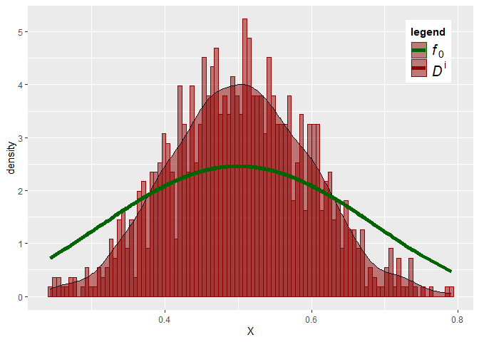
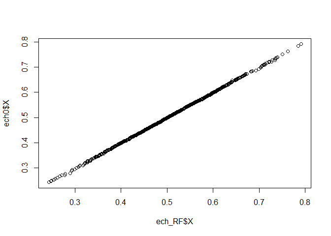

Data Augmentation for Imbalanced Regression - Illustration
================
Samuel STOCKSIEKER
25/01/2023

This code refers to the following paper : lien-Arxiv

*Import library*

<style>
body {
text-align: justify}
</style>

check packages version

``` r
sessionInfo()
```

    ## R version 4.2.2 (2022-10-31 ucrt)
    ## Platform: x86_64-w64-mingw32/x64 (64-bit)
    ## Running under: Windows 10 x64 (build 22621)
    ## 
    ## Matrix products: default
    ## 
    ## locale:
    ## [1] LC_COLLATE=French_France.utf8  LC_CTYPE=French_France.utf8   
    ## [3] LC_MONETARY=French_France.utf8 LC_NUMERIC=C                  
    ## [5] LC_TIME=French_France.utf8    
    ## 
    ## attached base packages:
    ## [1] stats     graphics  grDevices utils     datasets  methods   base     
    ## 
    ## other attached packages:
    ##  [1] latex2exp_0.9.6      plotly_4.10.1        seewave_2.2.0       
    ##  [4] statip_0.2.3         beepr_1.3            pdp_0.8.1           
    ##  [7] mda_0.5-3            class_7.3-20         earth_5.3.1         
    ## [10] plotmo_3.6.2         TeachingDemos_2.12   plotrix_3.8-2       
    ## [13] Formula_1.2-4        Metrics_0.1.4        mgcv_1.8-41         
    ## [16] nlme_3.1-160         synthpop_1.8-0       smotefamily_1.3.1   
    ## [19] kernelboot_0.1.9     mclust_6.0.0         ks_1.14.0           
    ## [22] reticulate_1.27      MASS_7.3-58.1        UBL_0.0.7           
    ## [25] randomForest_4.7-1.1 automap_1.0-16       sp_1.5-1            
    ## [28] gstat_2.1-0          MBA_0.1-0            ggplot2_3.4.0       
    ## 
    ## loaded via a namespace (and not attached):
    ##  [1] TH.data_1.1-1       colorspace_2.0-3    modeltools_0.2-23  
    ##  [4] mipfp_3.2.1         rmutil_1.1.10       clue_0.3-63        
    ##  [7] rstudioapi_0.14     proxy_0.4-27        listenv_0.9.0      
    ## [10] audio_0.1-10        fansi_1.0.3         mvtnorm_1.1-3      
    ## [13] coin_1.4-2          ranger_0.14.1       codetools_0.2-18   
    ## [16] splines_4.2.2       libcoin_1.0-9       knitr_1.41         
    ## [19] jsonlite_1.8.4      cluster_2.1.4       png_0.1-8          
    ## [22] httr_1.4.4          compiler_4.2.2      lazyeval_0.2.2     
    ## [25] Matrix_1.5-1        fastmap_1.1.0       strucchange_1.5-3  
    ## [28] cli_3.5.0           htmltools_0.5.4     tools_4.2.2        
    ## [31] gtable_0.3.1        glue_1.6.2          broman_0.80        
    ## [34] dplyr_1.0.10        Rcpp_1.0.9          vctrs_0.5.1        
    ## [37] iterators_1.0.14    xfun_0.36           stringr_1.5.0      
    ## [40] globals_0.16.2      proto_1.0.0         lifecycle_1.0.3    
    ## [43] cmm_0.12            future_1.30.0       polspline_1.1.22   
    ## [46] zoo_1.8-11          scales_1.2.1        parallel_4.2.2     
    ## [49] sandwich_3.0-2      yaml_2.3.6          rpart_4.1.19       
    ## [52] reshape_0.8.9       stringi_1.7.8       maptools_1.1-6     
    ## [55] foreach_1.5.2       e1071_1.7-12        truncnorm_1.0-8    
    ## [58] tuneR_1.4.2         intervals_0.15.2    rlang_1.0.6        
    ## [61] pkgconfig_2.0.3     matrixStats_0.63.0  Rsolnp_1.16        
    ## [64] pracma_2.4.2        evaluate_0.19       lattice_0.20-45    
    ## [67] purrr_1.0.0         htmlwidgets_1.6.1   tidyselect_1.2.0   
    ## [70] parallelly_1.34.0   plyr_1.8.8          magrittr_2.0.3     
    ## [73] R6_2.5.1            generics_0.1.3      multcomp_1.4-20    
    ## [76] pillar_1.8.1        foreign_0.8-83      withr_2.5.0        
    ## [79] xts_0.12.2          survival_3.4-0      nnet_7.3-18        
    ## [82] tibble_3.1.8        future.apply_1.10.0 spacetime_1.2-8    
    ## [85] KernSmooth_2.23-20  utf8_1.2.2          party_1.3-11       
    ## [88] rmarkdown_2.19      grid_4.2.2          data.table_1.14.6  
    ## [91] FNN_1.1.3.1         digest_0.6.31       classInt_0.4-8     
    ## [94] tidyr_1.2.1         numDeriv_2016.8-1.1 signal_0.7-7       
    ## [97] stats4_4.2.2        munsell_0.5.0       viridisLite_0.4.1

R version 4.2.0 (2022-04-22 ucrt) Platform: x86_64-w64-mingw32/x64
(64-bit) Running under: Windows 10 x64 (build 19045)

Matrix products: default

locale: \[1\] LC_COLLATE=French_France.utf8 LC_CTYPE=French_France.utf8
LC_MONETARY=French_France.utf8 \[4\] LC_NUMERIC=C
LC_TIME=French_France.utf8

attached base packages: \[1\] stats graphics grDevices utils datasets
methods base

other attached packages: \[1\] seewave_2.2.0 statip_0.2.3 beepr_1.3
pdp_0.8.1 mda_0.5-3  
\[6\] class_7.3-20 earth_5.3.1 plotmo_3.6.1 TeachingDemos_2.12
plotrix_3.8-2  
\[11\] Formula_1.2-4 Metrics_0.1.4 mgcv_1.8-40 nlme_3.1-157
synthpop_1.7-0  
\[16\] smotefamily_1.3.1 kernelboot_0.1.7 mclust_5.4.9 ks_1.13.5
reticulate_1.25  
\[21\] MASS_7.3-57 UBL_0.0.7 randomForest_4.7-1 automap_1.0-16
sp_1.4-7  
\[26\] gstat_2.0-9 MBA_0.0-9 ggplot2_3.4.0

loaded via a namespace (and not attached): \[1\] TH.data_1.1-1
colorspace_2.0-3 ellipsis_0.3.2 modeltools_0.2-23 mipfp_3.2.1  
\[6\] rprojroot_2.0.3 clue_0.3-61 rstudioapi_0.14 proxy_0.4-26
listenv_0.8.0  
\[11\] audio_0.1-10 fansi_1.0.3 mvtnorm_1.1-3 coin_1.4-2 ranger_0.13.1  
\[16\] codetools_0.2-18 splines_4.2.0 libcoin_1.0-9 knitr_1.39
jsonlite_1.8.0  
\[21\] cluster_2.1.3 png_0.1-7 compiler_4.2.0 Matrix_1.5-3
strucchange_1.5-2  
\[26\] cli_3.3.0 tools_4.2.0 gtable_0.3.0 glue_1.6.2 dplyr_1.0.9  
\[31\] rappdirs_0.3.3 Rcpp_1.0.8.3 vctrs_0.5.1 iterators_1.0.14
xfun_0.31  
\[36\] stringr_1.4.0 globals_0.15.0 proto_1.0.0 lifecycle_1.0.3
cmm_0.12  
\[41\] future_1.25.0 polspline_1.1.20 zoo_1.8-10 scales_1.2.0
parallel_4.2.0  
\[46\] sandwich_3.0-1 rpart_4.1.16 reshape_0.8.9 stringi_1.7.6
maptools_1.1-4  
\[51\] foreach_1.5.2 e1071_1.7-9 truncnorm_1.0-8 tuneR_1.4.0
intervals_0.15.2  
\[56\] rlang_1.0.6 pkgconfig_2.0.3 matrixStats_0.62.0 Rsolnp_1.16
pracma_2.3.8  
\[61\] lattice_0.20-45 purrr_0.3.4 tidyselect_1.1.2 here_1.0.1
parallelly_1.31.1  
\[66\] plyr_1.8.7 magrittr_2.0.3 R6_2.5.1 generics_0.1.2
multcomp_1.4-19  
\[71\] pillar_1.7.0 foreign_0.8-82 withr_2.5.0 xts_0.12.1
survival_3.3-1  
\[76\] nnet_7.3-17 tibble_3.1.7 future.apply_1.9.0 spacetime_1.2-6
crayon_1.5.1  
\[81\] KernSmooth_2.23-20 utf8_1.2.2 party_1.3-10 grid_4.2.0 FNN_1.1.3  
\[86\] digest_0.6.29 classInt_0.4-3 numDeriv_2016.8-1.1 signal_0.7-7
stats4_4.2.0  
\[91\] munsell_0.5.0

# Dataset simulation

## Population

We consider a bi-dimensional initial population
$\mathcal{D}^p = (X^p,Y^p)$, of size $n^p = 10,000$ such as:  
$X \sim F_0 = \mathcal{B}\text{eta}(5,5)$
$Y \sim \mathcal{N}(\sin(7X -0.5)+10,0.1)$ where ${\cal B}$ denotes the
Beta distribution and ${\cal N}$ denotes the Gaussian distribution.

``` r
if (rerun == T){
  n_pop = 10000 # size of the population
  alpha_pop = 5 # parameter of X distribution in the population
  beta_pop = 5 # parameter of X distribution in the population
  X_pop = rbeta (n_pop,alpha_pop, beta_pop) # simulation of X in the population
  hist(X_pop,breaks = 100)
  pop = data.frame(X=X_pop)
}
```

simulation of $Y$ as a function of $X$ according to the non-linear
relationship :

``` r
if (rerun == T){
  for (i in (1:nrow(pop))){
    pop$Y[i] = rnorm(1,sin(pop$X[i]*7 - 0.5) +10 ,0.1)
  }
}
plot(pop$X,pop$Y)
```

<!-- -->

## Sampling

The test, balanced, and imbalanced samples are all of size $n=1,000$.

### Test sample

From this population, we uniformly draw a test sample $\mathcal{D}^t$.

``` r
if (rerun == T){
  base=pop
  n_ech = 1000
  ind_test = sample(nrow(base),n_ech)
  test = base[ind_test,]
  base = base[-ind_test,]
  y_test = test$Y
  test$Y = NULL
}
```

### Balanced sample

From the remaining population, $\mathcal{D}^p$ \\ $\mathcal{D}^t$, we
uniformly draw a balanced sample $\mathcal{D}^b$, supposed to be
representative of the population.

``` r
if (rerun == T){
  ech_rep = base[sample(nrow(base),n_ech),]
}
```

### Imbalanced sample

Finally, we draw an imbalanced sample $\mathcal{D}^i$ from this
remaining population. The draw weights to construct this imbalanced
sample are defined by the distribution $F = \mathcal{B}\text{eta}(9,9)$
in order to get less observations on the sides.

``` r
plot(dbeta(x=seq(0,1,0.01), 9,9 ), col="darkred", type = 'l')
lines(dbeta(x=seq(0,1,0.01),alpha_pop ,beta_pop ), col="green3")
```

<!-- -->

``` r
if (rerun == T){
  ech = base[sample(nrow(base),n_ech,prob = dbeta(base$X,9,9)),]
  X_ech = ech$X
  ech0 = ech
}
```

Graphical analysis of the imbalanced sample

``` r
df_train=data.frame(ech$X,rep("imb",length(ech$X)))
df_test=data.frame(pop$X,rep("pop",length(test$X)))
colnames(df_train)=c("X","dataset")
colnames(df_test)=c("X","dataset")
df = rbind(df_train,df_test)

ggplot(df, aes(X, color=dataset, fill=dataset)) + 
  geom_histogram(alpha = 0.5,aes(y = ..density..),bins=100,position="identity")+
  geom_density(alpha=0.5)+
  scale_color_manual(values = c("pop" = "azure4", "imb" = "darkred"),labels = c(unname(TeX(c(r"($\textit{D}^i$)"))), unname(TeX(c(r"($\textit{D}^p$)"))))) + 
  scale_fill_manual(values = c("pop" = "azure4", "imb" = "darkred"),labels = c(unname(TeX(c(r"($\textit{D}^i$)"))), unname(TeX(c(r"($\textit{D}^p$)"))))) +
  theme(legend.position = c(.95, .95),legend.justification = c("right", "top"),legend.title = element_text(face = "bold"),legend.text = element_text(size=15,hjust=0))
```

<!-- -->

``` r
ggsave("Sorties_illustration/comp_X_Ech0-vs-Pop-Dens.png",width=7.29, height=4.5)

ggplot(df, aes(X, color=dataset, fill=dataset)) + 
  geom_histogram(alpha = 0.5,aes(y = ..density..),bins=100,position="identity")+
  scale_color_manual(values = c("pop" = "azure4", "imb" = "darkred"),labels = c(unname(TeX(c(r"($\textit{D}^i$)"))), unname(TeX(c(r"($\textit{D}^p$)"))))) + 
  scale_fill_manual(values = c("pop" = "azure4", "imb" = "darkred"),labels = c(unname(TeX(c(r"($\textit{D}^i$)"))), unname(TeX(c(r"($\textit{D}^p$)"))))) +
  theme(legend.position = c(.95, .95),legend.justification = c("right", "top"),legend.title = element_text(face = "bold"),legend.text = element_text(size=15,hjust=0))
```

<!-- -->

``` r
ggsave("Sorties_illustration/comp_X_Ech0-vs-Pop.png",width=7.29, height=4.5)

ggplot() + 
  geom_point(aes(x=pop$X, y=pop$Y, colour="pop")) + 
  geom_point(aes(x=ech0$X, y=ech0$Y, colour="imb"))+
  scale_color_manual(name = "dataset",values = c("pop" = "azure4", "imb" = "darkred"),labels = c(unname(TeX(c(r"($\textit{D}^i$)"))), unname(TeX(c(r"($\textit{D}^p$)"))))) + 
  theme(legend.position = c(.95, .95),legend.justification = c("right", "top"),legend.title = element_text(face = "bold"),legend.text = element_text(size=15,hjust=0)) +
  xlab("X") + ylab("Y")
```

<!-- -->

``` r
ggsave("Sorties_illustration/comp_Y_Ech0-vs-Pop.png",width=7.29, height=4.5)


df_train=data.frame(ech$X,rep("imb",length(ech$X)))
df_test=data.frame(test$X,rep("test",length(test$X)))
colnames(df_train)=c("X","dataset")
colnames(df_test)=c("X","dataset")
df = rbind(df_train,df_test)

ggplot(df, aes(X, color=dataset, fill=dataset)) + 
  geom_histogram(alpha = 0.5,aes(y = ..density..),bins=100,position="identity")+
  scale_color_manual(values = c("darkred","darkgreen"),labels = c(unname(TeX(c(r"($\textit{D}^i$)"))), unname(TeX(c(r"($\textit{D}^p$)"))))) + 
  scale_fill_manual(values = c("darkred","darkgreen"),labels = c(unname(TeX(c(r"($\textit{D}^i$)"))), unname(TeX(c(r"($\textit{D}^p$)"))))) +
  theme(legend.position = c(.95, .95),legend.justification = c("right", "top"),legend.title = element_text(face = "bold"),legend.text = element_text(size=15,hjust=0))
```

<!-- -->

Imbalanced analysis for the definition of Imbalanced Covariates
Regression in the paper.

``` r
# threshold 
a = 0.3
b = 0.7

# alpha 
(1-pbeta(b,5,5))/(1-pbeta(b,9,9)) - 1
```

    ## [1] 1.453232

``` r
# beta
pbeta(a,5,5)
```

    ## [1] 0.09880866

``` r
1-pbeta(b,5,5)
```

    ## [1] 0.09880866

we face an imbalanced regression: a $(\alpha, \beta)$-imbalanced problem
with, for example,
$\lvert \frac{\widehat{\mathbb{P}}(\boldsymbol{X}\in\chi)}{\mathbb{P}_0(\boldsymbol{X}\in\chi)} - 1 \rvert > \alpha$
when $\chi:= [0,0.3]$ or $\chi:= [0.7,1]$ and
($\alpha \leq 0.59, \beta \leq 0.09$). Here we are in the situation
where $F$ and $F_0$ have the same support and the imbalanced problem
will be less with $n$ large.

The impacts of the imbalanced sample on the prediction are visible on
the part “Performance Evaluation”

# DA-WR approach

To handle the imbalance, we want to draw a $n^*$-sample,
$\{(\boldsymbol{X}^*_i,Y^*_i)_{i=1,\cdots,n^*}\}$ from the initial
$n$-sample $\{(\boldsymbol{X}_i,Y_i)_{i=1,\cdots,n}\}$, such that the
cdf $F^*$ of $\boldsymbol{X^*}$ converges to the target $F_0$ with
associated probability $\mathbb{P}_0$.

We wish to redress the initial distribution of $X$ (in black) as follows
(in red):

``` r
ggplot(ech, aes(X)) + 
  geom_histogram(alpha = 0.5, aes(y = ..density..,color= "imb"),position = 'identity',bins=100, fill="darkred")+
  geom_density(alpha=0.5, fill = "darkred")+
  geom_line(aes(y=dbeta(ech$X,alpha_pop,beta_pop),colour="f0"), lwd=2,linetype = 1)+
  scale_color_manual(name = "legend",values = c("f0" = "darkgreen", "imb" = "darkred"),labels = c(unname(TeX(c(r"($\textit{f}_0$)"))), unname(TeX(c(r"($\textit{D}^i$)"))))) +
  theme(legend.position = c(.95, .95),legend.justification = c("right", "top"),legend.title = element_text(face = "bold"),legend.text = element_text(size=15,hjust=0))
```

<!-- -->

``` r
ggsave("Sorties_illustration/Hist_X_Ech0-vs-Tgt.png",width=7.29, height=4.5)
```

## Weighted Resampling (WR) algorithm

Resampling weights definition

``` r
# Target dstribution : population
Pt = function(x){
  dbeta(x,alpha_pop,beta_pop)
}

X = ech$X
pe = density(X,n=length(X)) # emmpiric distribution  : kernel estimator
ech$pe = approx(pe$x,pe$y,xout=ech$X)$y
ech$pt = Pt(X)
ech$w = ech$pt / ech$pe
ech$q = ech$w / sum(ech$w)

ggplot(ech, aes(x=X)) + geom_point(aes(y=q), colour="darkred") + labs(y = "weight")
```

<!-- -->

``` r
ggsave("Sorties_illustration/weights-ech0.png",width=7.29, height=4.5)
```

Drawing

``` r
if (rerun == T){
  # Drawing
  ech_add = sample(seq(1, nrow(ech)),n_ech,replace=T,prob = ech$q)
  ech_add = ech[ech_add,]
  
  # Variable selection
  filtre_var = c("X","Y")
  ech_add = ech_add[,filtre_var]
  ech0 = ech0[,filtre_var]
}
```

Obtained distribution after resampling

``` r
ggplot(ech_add, aes(X)) + 
  geom_histogram(alpha = 0.5, aes(y = ..density..,color= "WR"),position = 'identity',bins=100, fill="darkred")+
  geom_density(alpha=0.5, fill = "darkred")+
  geom_line(aes(y=dbeta(ech_add$X,alpha_pop,beta_pop),colour="f0"), lwd=2,linetype = 1)+
  scale_color_manual(name = "legend",values = c("f0" = "darkgreen", "WR" = "darkred"),labels = c(unname(TeX(c(r"($\textit{f}_0$)"))), unname(TeX(c(r"($\textit{D}^*(WR)$)"))))) +
  theme(legend.position = c(.95, .95),legend.justification = c("right", "top"),legend.title = element_text(face = "bold"),legend.text = element_text(size=15,hjust=0))
```

<!-- -->

``` r
ggsave("Sorties_illustration/Hist_X_Ech_add-vs-Tgt.png",width=7.29, height=4.5)
```

This last figure shows the new sample $\mathcal{D}^*$ which is closer to
target distribution than the initial one. However, the values on the
sides, quite rare, are naturally very drawn. We see there are still some
parts of the support without observation, especially on the right side.
This situation could lead to an overfitting phenomenon because the same
observations are replicated several times and could lead to an
over-fitting effect. To improve the weighted resampling, we propose to
combine it with a synthetic data generation.

Definition of a WR function to reuse it

``` r
WR = function(ech,X,N){
  # Drawing weights
  pe = density(X,n=length(X))
  pe = approx(pe$x,pe$y,xout=ech$X)$y
  pt = Pt(X)
  w = pt / pe
  q = w / sum(w)
  # Drawing
  ind = sample(seq(1, nrow(ech)),N,replace=T,prob = q)
  ech[ind,]
}
```

## Data Augmentation - Weighted Resampling algorithm

### Generation by random noise

#### Gaussian Noise (GN)

**Gaussian Noise on the augmented dataset and application of WR
algorithm**

Graphical analysis of the rebalanced sample

<!-- --><!-- --><!-- -->

**Gaussian Noise on the augmented dataset, by cluster and application of
WR algorithm**

Graphical analysis of clustering

<!-- -->

Graphical analysis of the rebalanced sample

<!-- --><!-- --><!-- -->

**Application of the Gaussian Noise for regression imbalanced, on the
augmented dataset and application of WR algorithm**

<!-- --><!-- --><!-- -->

Not relevant

#### Multivariate kernel density estimator (ROSE & KDE)

*Estimator inspired by ROSE* source code :
<https://rdrr.io/cran/ROSE/man/ROSE-package.html>

Graphical analysis of the rebalanced sample

<!-- --><!-- --><!-- -->

*application by cluster*

Graphical analysis of the rebalanced sample

<!-- --><!-- --><!-- -->

*Smoothed Bootstrap (KDE)* Same approach than ROSE but with another
bandwidth matrix

Graphical analysis of the rebalanced sample

<!-- --><!-- --><!-- -->

*application by cluster*

Graphical analysis of the rebalanced sample

<!-- --><!-- --><!-- -->

### Mixture model approach (latent structure model)

#### Gaussian Mixture Model (GMM)

<!-- -->

Graphical analysis of the rebalanced sample

<!-- --><!-- --><!-- -->

#### Factor analysis (FA)

Graphical analysis of the rebalanced sample

<!-- -->

*application by cluster*

Graphical analysis of the rebalanced sample

<!-- --><!-- --><!-- -->

### Copula

Graphical analysis of the rebalanced sample

<!-- --><!-- --><!-- -->

By definition, the copula simulations do not go beyond the min-max
values

### Conditional Generative Adversarial Net (GAN)

package CTGAN from SDV

*no conditional*

Graphical analysis of the rebalanced sample

<!-- --><!-- --><!-- -->

*application by cluster*

Graphical analysis of the rebalanced sample

<!-- --><!-- --><!-- -->

### k-NN Interpolation

#### interpolation inspired by SMOTE (SMOTE)

Graphical analysis of the rebalanced sample

<!-- --><!-- --><!-- -->

*application by cluster*

Graphical analysis of the rebalanced sample

<!-- --><!-- --><!-- -->

*SMOTE on the initial sample, binarised by clusters*

<!-- --><!-- --><!-- -->

Results non relevant

#### Approachs Utulity-Based Learning

1)  Error : “All the points have relevance 0. Please, redefine your
    relevance function!” 2 ) No possibility to define q as utility
    function : Error in GaussNoiseRegress(form = Y \~ ., dat = ech0, rel
    = rel) : All the points have relevance 1. Please, redefine your
    relevance function!
2)  too complicated to define q as a utility function (UBL an R package
    for … : p.50)

On $Y$ :

On $X$ :

<!-- --><!-- --><!-- -->
*Error* : “Error in SMOGNRegress(X \~ ., ech0) : All the points have
relevance 0. Please, redefine your relevance function!”

In both cases, this proposed solution does not meet the objective and
the generation of DS is not interesting: low values of $Y$ in the first
case and no orientation in the second.

### Random Forest (RF)

``` r
if (rerun == T){
  ech_RF=syn(ech0,method="rf", visit.sequence = c("X","Y"),k=1000, proper=T)
  ech_RF = ech_RF$syn
}
summary(ech_RF$X)
```

    ##    Min. 1st Qu.  Median    Mean 3rd Qu.    Max. 
    ##  0.2431  0.4388  0.5039  0.5034  0.5681  0.7909

``` r
summary(ech0$X)
```

    ##    Min. 1st Qu.  Median    Mean 3rd Qu.    Max. 
    ##  0.2431  0.4363  0.5028  0.5023  0.5678  0.7909

``` r
qqplot(ech_RF$X,ech0$X)
```

<!-- -->

``` r
hist(ech_RF$X, col=rgb(0,0,1,1/4),breaks = 100,prob=T) 
hist(ech0$X, col=rgb(1,0,0,1/4),breaks = 100,prob=T, add=T) 
```

<!-- -->

<!-- --><!-- --><!-- -->

*Conditionnal application by cluster*

Graphical analysis of the rebalanced sample

<!-- --><!-- --><!-- -->

# Performance evaluation

## Generalized Additive Model Learning

### Balanced sample

<!-- -->

    ## [1] "deviance expliquee : 97.7"

    ## [1] "RMSE : 10.24"

    ## [1] "R2 : 97.89"

<!-- -->

    ## `geom_smooth()` using formula = 'y ~ x'

<!-- -->

    ## `geom_smooth()` using formula = 'y ~ x'
    ## `geom_smooth()` using formula = 'y ~ x'
    ## `geom_smooth()` using formula = 'y ~ x'

<!-- -->

#### Imbalanced Sample

<!-- -->

    ## [1] "deviance expliquee : 96.47"

    ## [1] "RMSE : 13.32"

    ## [1] "R2 : 96.61"

<!-- -->

    ## `geom_smooth()` using formula = 'y ~ x'

<!-- -->

    ## `geom_smooth()` using formula = 'y ~ x'
    ## `geom_smooth()` using formula = 'y ~ x'

<!-- -->

#### Weighted Resampling (WR) sample

<!-- -->

    ## [1] "deviance expliquee : 97.46"

    ## [1] "RMSE : 12.72"

    ## [1] "R2 : 96.89"

<!-- -->

    ## `geom_smooth()` using formula = 'y ~ x'

<!-- -->

    ## `geom_smooth()` using formula = 'y ~ x'
    ## `geom_smooth()` using formula = 'y ~ x'

<!-- -->

#### GN-WR sample

<!-- -->

    ## [1] "deviance expliquee : 89.56"

    ## [1] "RMSE : 15.06"

    ## [1] "R2 : 95.53"

<!-- -->

    ## `geom_smooth()` using formula = 'y ~ x'

<!-- -->

    ## `geom_smooth()` using formula = 'y ~ x'
    ## `geom_smooth()` using formula = 'y ~ x'

<!-- -->

#### GN_GMM-WR sample

<!-- -->

    ## [1] "deviance expliquee : 95.37"

    ## [1] "RMSE : 12.25"

    ## [1] "R2 : 97.05"

<!-- -->

    ## `geom_smooth()` using formula = 'y ~ x'

<!-- -->

    ## `geom_smooth()` using formula = 'y ~ x'
    ## `geom_smooth()` using formula = 'y ~ x'

<!-- -->

#### ROSE-WR sample

<!-- -->

    ## [1] "deviance expliquee : 87.51"

    ## [1] "RMSE : 16.84"

    ## [1] "R2 : 94.5"

<!-- -->

    ## `geom_smooth()` using formula = 'y ~ x'

<!-- -->

    ## `geom_smooth()` using formula = 'y ~ x'
    ## `geom_smooth()` using formula = 'y ~ x'

<!-- -->

#### ROSE_GMM-WR sample

<!-- -->

    ## [1] "deviance expliquee : 93.14"

    ## [1] "RMSE : 13.29"

    ## [1] "R2 : 96.55"

<!-- -->

    ## `geom_smooth()` using formula = 'y ~ x'

<!-- -->

    ## `geom_smooth()` using formula = 'y ~ x'
    ## `geom_smooth()` using formula = 'y ~ x'

<!-- -->

#### KDE-WR sample

<!-- -->

    ## [1] "deviance expliquee : 96.6"

    ## [1] "RMSE : 21.83"

    ## [1] "R2 : 92.02"

<!-- -->

    ## `geom_smooth()` using formula = 'y ~ x'

<!-- -->

    ## `geom_smooth()` using formula = 'y ~ x'
    ## `geom_smooth()` using formula = 'y ~ x'

<!-- -->

#### KDE_GMM-WR sample

<!-- -->

    ## [1] "deviance expliquee : 97.81"

    ## [1] "RMSE : 13"

    ## [1] "R2 : 96.91"

<!-- -->

    ## `geom_smooth()` using formula = 'y ~ x'

<!-- -->

    ## `geom_smooth()` using formula = 'y ~ x'
    ## `geom_smooth()` using formula = 'y ~ x'

<!-- -->

#### GMM-WR sample

<!-- -->

    ## [1] "deviance expliquee : 97.55"

    ## [1] "RMSE : 15.06"

    ## [1] "R2 : 95.92"

<!-- -->

    ## `geom_smooth()` using formula = 'y ~ x'

<!-- -->

    ## `geom_smooth()` using formula = 'y ~ x'
    ## `geom_smooth()` using formula = 'y ~ x'

<!-- -->

#### FA_GMM-WR sample

<!-- -->

    ## [1] "deviance expliquee : 97.64"

    ## [1] "RMSE : 14.3"

    ## [1] "R2 : 96.15"

<!-- -->

    ## `geom_smooth()` using formula = 'y ~ x'

<!-- -->

    ## `geom_smooth()` using formula = 'y ~ x'
    ## `geom_smooth()` using formula = 'y ~ x'

<!-- -->

#### Copula-WR sample

<!-- -->

    ## [1] "deviance expliquee : 95.41"

    ## [1] "RMSE : 25.55"

    ## [1] "R2 : 90.11"

<!-- -->

    ## `geom_smooth()` using formula = 'y ~ x'

<!-- -->

    ## `geom_smooth()` using formula = 'y ~ x'
    ## `geom_smooth()` using formula = 'y ~ x'

<!-- -->

#### GAN-WR sample

<!-- -->

    ## [1] "deviance expliquee : 93.91"

    ## [1] "RMSE : 24.39"

    ## [1] "R2 : 91.49"

<!-- -->

    ## `geom_smooth()` using formula = 'y ~ x'

<!-- -->

    ## `geom_smooth()` using formula = 'y ~ x'
    ## `geom_smooth()` using formula = 'y ~ x'

<!-- -->

#### GAN_GMM-WR sample

<!-- -->

    ## [1] "deviance expliquee : 85.91"

    ## [1] "RMSE : 18.19"

    ## [1] "R2 : 93.39"

<!-- -->

    ## `geom_smooth()` using formula = 'y ~ x'

<!-- -->

    ## `geom_smooth()` using formula = 'y ~ x'
    ## `geom_smooth()` using formula = 'y ~ x'

<!-- -->

#### SMOTE-WR sample

<!-- -->

    ## [1] "deviance expliquee : 97.43"

    ## [1] "RMSE : 13.44"

    ## [1] "R2 : 96.52"

<!-- -->

    ## `geom_smooth()` using formula = 'y ~ x'

<!-- -->

    ## `geom_smooth()` using formula = 'y ~ x'
    ## `geom_smooth()` using formula = 'y ~ x'

<!-- -->

#### SMOTE_GMM-WR sample

<!-- -->

    ## [1] "deviance expliquee : 98.2"

    ## [1] "RMSE : 11.24"

    ## [1] "R2 : 97.48"

<!-- -->

    ## `geom_smooth()` using formula = 'y ~ x'

<!-- -->

    ## `geom_smooth()` using formula = 'y ~ x'
    ## `geom_smooth()` using formula = 'y ~ x'

<!-- -->

#### RF-WR sample

<!-- -->

    ## [1] "deviance expliquee : 87.96"

    ## [1] "RMSE : 17.66"

    ## [1] "R2 : 94.17"

<!-- -->

    ## `geom_smooth()` using formula = 'y ~ x'

<!-- -->

    ## `geom_smooth()` using formula = 'y ~ x'
    ## `geom_smooth()` using formula = 'y ~ x'

<!-- -->

## Random Forest Learning

#### Balanced sample

<!-- -->

    ## [1] "pseudo-R2 : 96.5"

    ## [1] "RMSE : 12.09"

    ## [1] "R2 : 97.07"

<!-- -->

    ## `geom_smooth()` using formula = 'y ~ x'
    ## `geom_smooth()` using formula = 'y ~ x'
    ## `geom_smooth()` using formula = 'y ~ x'
    ## `geom_smooth()` using formula = 'y ~ x'

<!-- -->

    ## `geom_smooth()` using formula = 'y ~ x'
    ## `geom_smooth()` using formula = 'y ~ x'
    ## `geom_smooth()` using formula = 'y ~ x'
    ## `geom_smooth()` using formula = 'y ~ x'
    ## `geom_smooth()` using formula = 'y ~ x'
    ## `geom_smooth()` using formula = 'y ~ x'
    ## `geom_smooth()` using formula = 'y ~ x'
    ## `geom_smooth()` using formula = 'y ~ x'
    ## `geom_smooth()` using formula = 'y ~ x'
    ## `geom_smooth()` using formula = 'y ~ x'
    ## `geom_smooth()` using formula = 'y ~ x'
    ## `geom_smooth()` using formula = 'y ~ x'

<!-- -->

#### Imbalanced sample

<!-- -->

    ## [1] "pseudo-R2 : 94.61"

    ## [1] "RMSE : 15.49"

    ## [1] "R2 : 95.59"

<!-- -->

    ## `geom_smooth()` using formula = 'y ~ x'
    ## `geom_smooth()` using formula = 'y ~ x'
    ## `geom_smooth()` using formula = 'y ~ x'
    ## `geom_smooth()` using formula = 'y ~ x'

<!-- -->

    ## `geom_smooth()` using formula = 'y ~ x'
    ## `geom_smooth()` using formula = 'y ~ x'
    ## `geom_smooth()` using formula = 'y ~ x'
    ## `geom_smooth()` using formula = 'y ~ x'
    ## `geom_smooth()` using formula = 'y ~ x'
    ## `geom_smooth()` using formula = 'y ~ x'
    ## `geom_smooth()` using formula = 'y ~ x'
    ## `geom_smooth()` using formula = 'y ~ x'

<!-- -->

#### Weighted Resampling (WR) sample

<!-- -->

    ## [1] "pseudo-R2 : 98.25"

    ## [1] "RMSE : 16.06"

    ## [1] "R2 : 95.21"

<!-- -->

    ## `geom_smooth()` using formula = 'y ~ x'
    ## `geom_smooth()` using formula = 'y ~ x'
    ## `geom_smooth()` using formula = 'y ~ x'
    ## `geom_smooth()` using formula = 'y ~ x'

<!-- -->

    ## `geom_smooth()` using formula = 'y ~ x'
    ## `geom_smooth()` using formula = 'y ~ x'
    ## `geom_smooth()` using formula = 'y ~ x'
    ## `geom_smooth()` using formula = 'y ~ x'
    ## `geom_smooth()` using formula = 'y ~ x'
    ## `geom_smooth()` using formula = 'y ~ x'
    ## `geom_smooth()` using formula = 'y ~ x'
    ## `geom_smooth()` using formula = 'y ~ x'

<!-- -->

#### GN-WR sample

<!-- -->

    ## [1] "pseudo-R2 : 85.11"

    ## [1] "RMSE : 21.75"

    ## [1] "R2 : 91.04"

<!-- -->

    ## `geom_smooth()` using formula = 'y ~ x'
    ## `geom_smooth()` using formula = 'y ~ x'
    ## `geom_smooth()` using formula = 'y ~ x'
    ## `geom_smooth()` using formula = 'y ~ x'

<!-- -->

    ## `geom_smooth()` using formula = 'y ~ x'
    ## `geom_smooth()` using formula = 'y ~ x'
    ## `geom_smooth()` using formula = 'y ~ x'
    ## `geom_smooth()` using formula = 'y ~ x'
    ## `geom_smooth()` using formula = 'y ~ x'
    ## `geom_smooth()` using formula = 'y ~ x'
    ## `geom_smooth()` using formula = 'y ~ x'
    ## `geom_smooth()` using formula = 'y ~ x'

<!-- -->

#### GN_GMM-WR sample

<!-- -->

    ## [1] "pseudo-R2 : 93.17"

    ## [1] "RMSE : 16.05"

    ## [1] "R2 : 95.02"

<!-- -->

    ## `geom_smooth()` using formula = 'y ~ x'
    ## `geom_smooth()` using formula = 'y ~ x'
    ## `geom_smooth()` using formula = 'y ~ x'
    ## `geom_smooth()` using formula = 'y ~ x'

<!-- -->

    ## `geom_smooth()` using formula = 'y ~ x'
    ## `geom_smooth()` using formula = 'y ~ x'
    ## `geom_smooth()` using formula = 'y ~ x'
    ## `geom_smooth()` using formula = 'y ~ x'
    ## `geom_smooth()` using formula = 'y ~ x'
    ## `geom_smooth()` using formula = 'y ~ x'
    ## `geom_smooth()` using formula = 'y ~ x'
    ## `geom_smooth()` using formula = 'y ~ x'

<!-- -->

#### ROSE-WR sample

<!-- -->

    ## [1] "pseudo-R2 : 90.69"

    ## [1] "RMSE : 24.61"

    ## [1] "R2 : 88.77"

<!-- -->

    ## `geom_smooth()` using formula = 'y ~ x'
    ## `geom_smooth()` using formula = 'y ~ x'
    ## `geom_smooth()` using formula = 'y ~ x'
    ## `geom_smooth()` using formula = 'y ~ x'

<!-- -->

    ## `geom_smooth()` using formula = 'y ~ x'
    ## `geom_smooth()` using formula = 'y ~ x'
    ## `geom_smooth()` using formula = 'y ~ x'
    ## `geom_smooth()` using formula = 'y ~ x'
    ## `geom_smooth()` using formula = 'y ~ x'
    ## `geom_smooth()` using formula = 'y ~ x'
    ## `geom_smooth()` using formula = 'y ~ x'
    ## `geom_smooth()` using formula = 'y ~ x'

<!-- -->

#### ROSE_GMM-WR sample

<!-- -->

    ## [1] "pseudo-R2 : 89.71"

    ## [1] "RMSE : 18.36"

    ## [1] "R2 : 93.57"

<!-- -->

    ## `geom_smooth()` using formula = 'y ~ x'
    ## `geom_smooth()` using formula = 'y ~ x'
    ## `geom_smooth()` using formula = 'y ~ x'
    ## `geom_smooth()` using formula = 'y ~ x'

<!-- -->

    ## `geom_smooth()` using formula = 'y ~ x'
    ## `geom_smooth()` using formula = 'y ~ x'
    ## `geom_smooth()` using formula = 'y ~ x'
    ## `geom_smooth()` using formula = 'y ~ x'
    ## `geom_smooth()` using formula = 'y ~ x'
    ## `geom_smooth()` using formula = 'y ~ x'
    ## `geom_smooth()` using formula = 'y ~ x'
    ## `geom_smooth()` using formula = 'y ~ x'

<!-- -->

#### KDE-WR sample

<!-- -->

    ## [1] "pseudo-R2 : 95.12"

    ## [1] "RMSE : 22.24"

    ## [1] "R2 : 91.74"

<!-- -->

    ## `geom_smooth()` using formula = 'y ~ x'
    ## `geom_smooth()` using formula = 'y ~ x'
    ## `geom_smooth()` using formula = 'y ~ x'
    ## `geom_smooth()` using formula = 'y ~ x'

<!-- -->

    ## `geom_smooth()` using formula = 'y ~ x'
    ## `geom_smooth()` using formula = 'y ~ x'
    ## `geom_smooth()` using formula = 'y ~ x'
    ## `geom_smooth()` using formula = 'y ~ x'
    ## `geom_smooth()` using formula = 'y ~ x'
    ## `geom_smooth()` using formula = 'y ~ x'
    ## `geom_smooth()` using formula = 'y ~ x'
    ## `geom_smooth()` using formula = 'y ~ x'

<!-- -->

#### KDE_GMM-WR sample

<!-- -->

    ## [1] "pseudo-R2 : 96.91"

    ## [1] "RMSE : 15.11"

    ## [1] "R2 : 95.9"

<!-- -->

    ## `geom_smooth()` using formula = 'y ~ x'
    ## `geom_smooth()` using formula = 'y ~ x'
    ## `geom_smooth()` using formula = 'y ~ x'
    ## `geom_smooth()` using formula = 'y ~ x'

<!-- -->

    ## `geom_smooth()` using formula = 'y ~ x'
    ## `geom_smooth()` using formula = 'y ~ x'
    ## `geom_smooth()` using formula = 'y ~ x'
    ## `geom_smooth()` using formula = 'y ~ x'
    ## `geom_smooth()` using formula = 'y ~ x'
    ## `geom_smooth()` using formula = 'y ~ x'
    ## `geom_smooth()` using formula = 'y ~ x'
    ## `geom_smooth()` using formula = 'y ~ x'

<!-- -->

#### GMM-WR sample

<!-- -->

    ## [1] "pseudo-R2 : 96.32"

    ## [1] "RMSE : 16.6"

    ## [1] "R2 : 95.15"

<!-- -->

    ## `geom_smooth()` using formula = 'y ~ x'
    ## `geom_smooth()` using formula = 'y ~ x'
    ## `geom_smooth()` using formula = 'y ~ x'
    ## `geom_smooth()` using formula = 'y ~ x'

<!-- -->

    ## `geom_smooth()` using formula = 'y ~ x'
    ## `geom_smooth()` using formula = 'y ~ x'
    ## `geom_smooth()` using formula = 'y ~ x'
    ## `geom_smooth()` using formula = 'y ~ x'
    ## `geom_smooth()` using formula = 'y ~ x'
    ## `geom_smooth()` using formula = 'y ~ x'
    ## `geom_smooth()` using formula = 'y ~ x'
    ## `geom_smooth()` using formula = 'y ~ x'

<!-- -->

#### FA_GMM-WR sample

<!-- -->

    ## [1] "pseudo-R2 : 97.02"

    ## [1] "RMSE : 16.41"

    ## [1] "R2 : 94.96"

<!-- -->

    ## `geom_smooth()` using formula = 'y ~ x'
    ## `geom_smooth()` using formula = 'y ~ x'
    ## `geom_smooth()` using formula = 'y ~ x'
    ## `geom_smooth()` using formula = 'y ~ x'

<!-- -->

    ## `geom_smooth()` using formula = 'y ~ x'
    ## `geom_smooth()` using formula = 'y ~ x'
    ## `geom_smooth()` using formula = 'y ~ x'
    ## `geom_smooth()` using formula = 'y ~ x'
    ## `geom_smooth()` using formula = 'y ~ x'
    ## `geom_smooth()` using formula = 'y ~ x'
    ## `geom_smooth()` using formula = 'y ~ x'
    ## `geom_smooth()` using formula = 'y ~ x'

<!-- -->

#### Copula-WR sample

<!-- -->

    ## [1] "pseudo-R2 : 93.44"

    ## [1] "RMSE : 22.5"

    ## [1] "R2 : 91.73"

<!-- -->

    ## `geom_smooth()` using formula = 'y ~ x'
    ## `geom_smooth()` using formula = 'y ~ x'
    ## `geom_smooth()` using formula = 'y ~ x'
    ## `geom_smooth()` using formula = 'y ~ x'

<!-- -->

    ## `geom_smooth()` using formula = 'y ~ x'
    ## `geom_smooth()` using formula = 'y ~ x'
    ## `geom_smooth()` using formula = 'y ~ x'
    ## `geom_smooth()` using formula = 'y ~ x'
    ## `geom_smooth()` using formula = 'y ~ x'
    ## `geom_smooth()` using formula = 'y ~ x'
    ## `geom_smooth()` using formula = 'y ~ x'
    ## `geom_smooth()` using formula = 'y ~ x'

<!-- -->

#### GAN-WR sample

<!-- -->

    ## [1] "pseudo-R2 : 91.16"

    ## [1] "RMSE : 26.26"

    ## [1] "R2 : 90.05"

<!-- -->

    ## `geom_smooth()` using formula = 'y ~ x'
    ## `geom_smooth()` using formula = 'y ~ x'
    ## `geom_smooth()` using formula = 'y ~ x'
    ## `geom_smooth()` using formula = 'y ~ x'

<!-- -->

    ## `geom_smooth()` using formula = 'y ~ x'
    ## `geom_smooth()` using formula = 'y ~ x'
    ## `geom_smooth()` using formula = 'y ~ x'
    ## `geom_smooth()` using formula = 'y ~ x'
    ## `geom_smooth()` using formula = 'y ~ x'
    ## `geom_smooth()` using formula = 'y ~ x'
    ## `geom_smooth()` using formula = 'y ~ x'
    ## `geom_smooth()` using formula = 'y ~ x'

<!-- -->

#### GAN_GMM-WR sample

<!-- -->

    ## [1] "pseudo-R2 : 78.9"

    ## [1] "RMSE : 24.21"

    ## [1] "R2 : 88.36"

<!-- -->

    ## `geom_smooth()` using formula = 'y ~ x'
    ## `geom_smooth()` using formula = 'y ~ x'
    ## `geom_smooth()` using formula = 'y ~ x'
    ## `geom_smooth()` using formula = 'y ~ x'

<!-- -->

    ## `geom_smooth()` using formula = 'y ~ x'
    ## `geom_smooth()` using formula = 'y ~ x'
    ## `geom_smooth()` using formula = 'y ~ x'
    ## `geom_smooth()` using formula = 'y ~ x'
    ## `geom_smooth()` using formula = 'y ~ x'
    ## `geom_smooth()` using formula = 'y ~ x'
    ## `geom_smooth()` using formula = 'y ~ x'
    ## `geom_smooth()` using formula = 'y ~ x'

<!-- -->

#### SMOTE-WR sample

<!-- -->

    ## [1] "pseudo-R2 : 96.68"

    ## [1] "RMSE : 16.07"

    ## [1] "R2 : 94.88"

<!-- -->

    ## `geom_smooth()` using formula = 'y ~ x'
    ## `geom_smooth()` using formula = 'y ~ x'
    ## `geom_smooth()` using formula = 'y ~ x'
    ## `geom_smooth()` using formula = 'y ~ x'

<!-- -->

    ## `geom_smooth()` using formula = 'y ~ x'
    ## `geom_smooth()` using formula = 'y ~ x'
    ## `geom_smooth()` using formula = 'y ~ x'
    ## `geom_smooth()` using formula = 'y ~ x'
    ## `geom_smooth()` using formula = 'y ~ x'
    ## `geom_smooth()` using formula = 'y ~ x'
    ## `geom_smooth()` using formula = 'y ~ x'
    ## `geom_smooth()` using formula = 'y ~ x'

<!-- -->

#### SMOTE-GMM-WR sample

<!-- -->

    ## [1] "pseudo-R2 : 97.73"

    ## [1] "RMSE : 14.75"

    ## [1] "R2 : 95.91"

<!-- -->

    ## `geom_smooth()` using formula = 'y ~ x'
    ## `geom_smooth()` using formula = 'y ~ x'
    ## `geom_smooth()` using formula = 'y ~ x'
    ## `geom_smooth()` using formula = 'y ~ x'

<!-- -->

    ## `geom_smooth()` using formula = 'y ~ x'
    ## `geom_smooth()` using formula = 'y ~ x'
    ## `geom_smooth()` using formula = 'y ~ x'
    ## `geom_smooth()` using formula = 'y ~ x'
    ## `geom_smooth()` using formula = 'y ~ x'
    ## `geom_smooth()` using formula = 'y ~ x'
    ## `geom_smooth()` using formula = 'y ~ x'
    ## `geom_smooth()` using formula = 'y ~ x'

<!-- -->

#### RF-WR sample

<!-- -->

    ## [1] "pseudo-R2 : 84.53"

    ## [1] "RMSE : 20.41"

    ## [1] "R2 : 91.79"

<!-- -->

    ## `geom_smooth()` using formula = 'y ~ x'
    ## `geom_smooth()` using formula = 'y ~ x'
    ## `geom_smooth()` using formula = 'y ~ x'
    ## `geom_smooth()` using formula = 'y ~ x'

<!-- -->

    ## `geom_smooth()` using formula = 'y ~ x'
    ## `geom_smooth()` using formula = 'y ~ x'
    ## `geom_smooth()` using formula = 'y ~ x'
    ## `geom_smooth()` using formula = 'y ~ x'
    ## `geom_smooth()` using formula = 'y ~ x'
    ## `geom_smooth()` using formula = 'y ~ x'
    ## `geom_smooth()` using formula = 'y ~ x'
    ## `geom_smooth()` using formula = 'y ~ x'

<!-- -->

## Multivariate Adaptative Regression Spline Learning

#### Balanced sample

<!-- -->

    ## [1] "pseudo-R2 : 97.37"

    ## [1] "RMSE : 10.73"

    ## [1] "R2 : 97.68"

<!-- -->

    ## `geom_smooth()` using formula = 'y ~ x'

<!-- -->

    ## `geom_smooth()` using formula = 'y ~ x'
    ## `geom_smooth()` using formula = 'y ~ x'

<!-- -->

#### Imbalanced sample

<!-- -->

    ## [1] "pseudo-R2 : 96.4"

    ## [1] "RMSE : 16.52"

    ## [1] "R2 : 95.02"

<!-- -->

    ## `geom_smooth()` using formula = 'y ~ x'

<!-- -->

    ## `geom_smooth()` using formula = 'y ~ x'
    ## `geom_smooth()` using formula = 'y ~ x'

<!-- -->

#### Weighted Resampling (WR) sample

<!-- -->

    ## [1] "pseudo-R2 : 97.36"

    ## [1] "RMSE : 13.9"

    ## [1] "R2 : 96.35"

<!-- -->

    ## `geom_smooth()` using formula = 'y ~ x'

<!-- -->

    ## `geom_smooth()` using formula = 'y ~ x'
    ## `geom_smooth()` using formula = 'y ~ x'

<!-- -->

#### GN-WR sample

<!-- -->

    ## [1] "pseudo-R2 : 89.5"

    ## [1] "RMSE : 15.15"

    ## [1] "R2 : 95.5"

<!-- -->

    ## `geom_smooth()` using formula = 'y ~ x'

<!-- -->

    ## `geom_smooth()` using formula = 'y ~ x'
    ## `geom_smooth()` using formula = 'y ~ x'

<!-- -->

#### GN_GMM-WR sample

<!-- -->

    ## [1] "pseudo-R2 : 95.21"

    ## [1] "RMSE : 13.31"

    ## [1] "R2 : 96.56"

<!-- -->

    ## `geom_smooth()` using formula = 'y ~ x'

<!-- -->

    ## `geom_smooth()` using formula = 'y ~ x'
    ## `geom_smooth()` using formula = 'y ~ x'

<!-- -->

#### ROSE-WR sample

<!-- -->

    ## [1] "pseudo-R2 : 87.51"

    ## [1] "RMSE : 17.66"

    ## [1] "R2 : 93.98"

<!-- -->

    ## `geom_smooth()` using formula = 'y ~ x'

<!-- -->

    ## `geom_smooth()` using formula = 'y ~ x'
    ## `geom_smooth()` using formula = 'y ~ x'

<!-- -->

#### ROSE_GMM-WR sample

<!-- -->

    ## [1] "pseudo-R2 : 93.08"

    ## [1] "RMSE : 13.71"

    ## [1] "R2 : 96.34"

<!-- -->

    ## `geom_smooth()` using formula = 'y ~ x'

<!-- -->

    ## `geom_smooth()` using formula = 'y ~ x'
    ## `geom_smooth()` using formula = 'y ~ x'

<!-- -->

#### KDE-WR sample

<!-- -->

    ## [1] "pseudo-R2 : 96.47"

    ## [1] "RMSE : 19.9"

    ## [1] "R2 : 93.34"

<!-- -->

    ## `geom_smooth()` using formula = 'y ~ x'

<!-- -->

    ## `geom_smooth()` using formula = 'y ~ x'
    ## `geom_smooth()` using formula = 'y ~ x'

<!-- -->

#### KDE_GMM-WR sample

<!-- -->

    ## [1] "pseudo-R2 : 97.73"

    ## [1] "RMSE : 13.17"

    ## [1] "R2 : 96.85"

<!-- -->

    ## `geom_smooth()` using formula = 'y ~ x'

<!-- -->

    ## `geom_smooth()` using formula = 'y ~ x'
    ## `geom_smooth()` using formula = 'y ~ x'

<!-- -->

#### GMM-WR sample

<!-- -->

    ## [1] "pseudo-R2 : 97.51"

    ## [1] "RMSE : 15.07"

    ## [1] "R2 : 95.94"

<!-- -->

    ## `geom_smooth()` using formula = 'y ~ x'

<!-- -->

    ## `geom_smooth()` using formula = 'y ~ x'
    ## `geom_smooth()` using formula = 'y ~ x'

<!-- -->

#### FA_GMM-WR sample

<!-- -->

    ## [1] "pseudo-R2 : 97.59"

    ## [1] "RMSE : 14.48"

    ## [1] "R2 : 96.11"

<!-- -->

    ## `geom_smooth()` using formula = 'y ~ x'

<!-- -->

    ## `geom_smooth()` using formula = 'y ~ x'
    ## `geom_smooth()` using formula = 'y ~ x'

<!-- -->

#### Copula-WR sample

<!-- -->

    ## [1] "pseudo-R2 : 95.37"

    ## [1] "RMSE : 25.11"

    ## [1] "R2 : 90.35"

<!-- -->

    ## `geom_smooth()` using formula = 'y ~ x'

<!-- -->

    ## `geom_smooth()` using formula = 'y ~ x'
    ## `geom_smooth()` using formula = 'y ~ x'

<!-- -->

#### GAN-WR sample

<!-- -->

    ## [1] "pseudo-R2 : 93.85"

    ## [1] "RMSE : 24.66"

    ## [1] "R2 : 91.33"

<!-- -->

    ## `geom_smooth()` using formula = 'y ~ x'

<!-- -->

    ## `geom_smooth()` using formula = 'y ~ x'
    ## `geom_smooth()` using formula = 'y ~ x'

<!-- -->

#### GAN_GMM-WR sample

<!-- -->

    ## [1] "pseudo-R2 : 85.84"

    ## [1] "RMSE : 19.01"

    ## [1] "R2 : 92.74"

<!-- -->

    ## `geom_smooth()` using formula = 'y ~ x'

<!-- -->

    ## `geom_smooth()` using formula = 'y ~ x'
    ## `geom_smooth()` using formula = 'y ~ x'

<!-- -->

#### SMOTE-WR sample

<!-- -->

    ## [1] "pseudo-R2 : 97.37"

    ## [1] "RMSE : 14.22"

    ## [1] "R2 : 96.01"

<!-- -->

    ## `geom_smooth()` using formula = 'y ~ x'

<!-- -->

    ## `geom_smooth()` using formula = 'y ~ x'
    ## `geom_smooth()` using formula = 'y ~ x'

<!-- -->

#### SMOTE_GMM-WR sample

<!-- -->

    ## [1] "pseudo-R2 : 98.09"

    ## [1] "RMSE : 13.55"

    ## [1] "R2 : 96.44"

<!-- -->

    ## `geom_smooth()` using formula = 'y ~ x'

<!-- -->

    ## `geom_smooth()` using formula = 'y ~ x'
    ## `geom_smooth()` using formula = 'y ~ x'

<!-- -->

#### RF-WR sample

<!-- -->

    ## [1] "pseudo-R2 : 87.95"

    ## [1] "RMSE : 17.31"

    ## [1] "R2 : 94.48"

<!-- -->

    ## `geom_smooth()` using formula = 'y ~ x'

<!-- -->

    ## `geom_smooth()` using formula = 'y ~ x'
    ## `geom_smooth()` using formula = 'y ~ x'

<!-- -->

*Calcul distance X*

``` r
# KSD_X = data.frame("ech" = rep(" ",16), "KSD" = rep(0,16))
# KSD_X$ech = c("Di (imb)","WR","GN","GN-GMM","ROSE","ROSE-GMM","KDE","KDE-GMM",                  "GMM","FA_GMM","Copule","GAN","GAN-GMM","SMOTE","SMOTE-GMM","RF") 
# 
# 
# KSD_X$KSD[1] = ks.test(ech0$X,ech_rep$X)$statistic
# KSD_X$KSD[2] = ks.test(ech_add$X,ech_rep$X)$statistic
# KSD_X$KSD[3] = ks.test(ech_GN_SC$X,ech_rep$X)$statistic
# KSD_X$KSD[4] = ks.test(GN_GMM$X,ech_rep$X)$statistic
# KSD_X$KSD[5] = ks.test(ech_ROSE_SC$X,ech_rep$X)$statistic
# KSD_X$KSD[6] = ks.test(ROSE_GMM$X,ech_rep$X)$statistic
# KSD_X$KSD[7] = ks.test(kde_boot$X,ech_rep$X)$statistic
# KSD_X$KSD[8] = ks.test(kde_boot_GMM$X,ech_rep$X)$statistic
# KSD_X$KSD[9] = ks.test(GMM$X,ech_rep$X)$statistic
# KSD_X$KSD[10] = ks.test(FA_GMM$X,ech_rep$X)$statistic
# KSD_X$KSD[11] = ks.test(ech_copule$X,ech_rep$X)$statistic
# KSD_X$KSD[12] = ks.test(ech_GAN$X,ech_rep$X)$statistic
# KSD_X$KSD[13] = ks.test(ech_ctganSynth_GMM$X,ech_rep$X)$statistic
# KSD_X$KSD[14] = ks.test(ech_smote$X,ech_rep$X)$statistic
# KSD_X$KSD[15] = ks.test(ech_smote_GMM$X,ech_rep$X)$statistic
# KSD_X$KSD[16] = ks.test(ech_RF2$X,ech_rep$X)$statistic
# #barplot(KSD_X$KSD, legend.text = KSD_X$ech,col = brewer.pal(n=nrow(KSD_X),"RdBu"))
# 
# label_x =  factor(KSD_X$ech, levels = KSD_X$ech)
# fig <- plot_ly(KSD_X,x= label_x,y = ~ KSD, color = ~ ech, type = "bar", main = "KS distance X with respect to the balanced sample")  
# fig 
```
